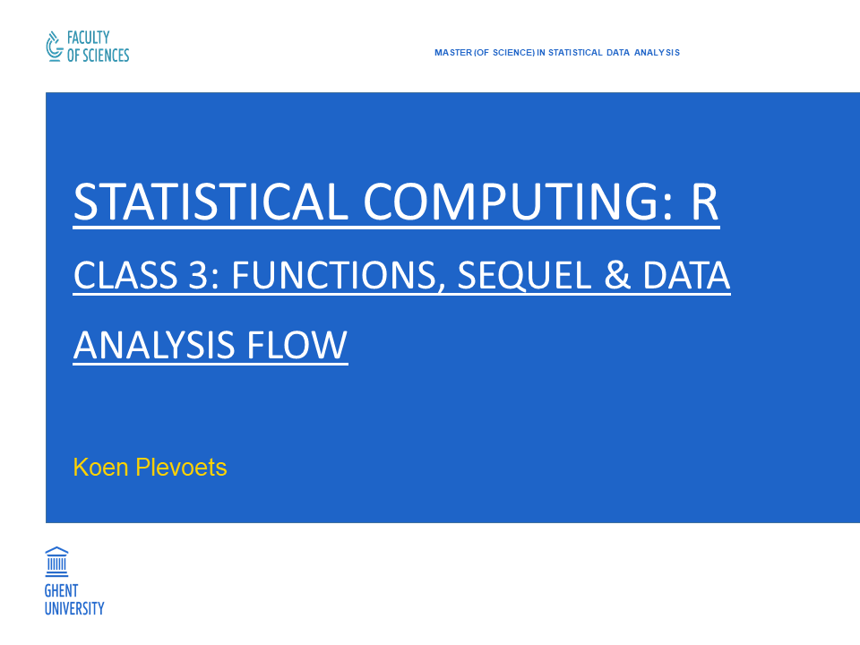

```{r setup, include=FALSE}
knitr::opts_chunk$set(collapse = TRUE, highlight = FALSE)
```

---

```{r cover, echo=FALSE, fig.align="center", out.width="85%"}

```

## Class 3: Functions, sequel & Data analysis flow

- Chapter 7: **Meta-functions**
    - 7.1: **The apply family**
    - 7.2: **Some other meta-functions**
- Chapter 8: **Data analysis flow**
    - 8.1: **Reading and writing files**
    - 8.2: **Subsetting data**
    - 8.3: **Merging data frames**
    - 8.4: **Reshaping data frames**
    - 8.5: **Transforming variables**
    - 8.6: **Ordering observations**
- Chapter 9: **Simulations**

## 7. Meta-functions

- R has various **meta-functions** in to to make computations **vectorized**:
  - The apply family
  - Higher-order functions for functional programming
  - ...
- We discuss the higher-order functions together with some of R's other meta-functions.

## 7.1 The apply family

- Many loops over data can be implemented with the **apply family** of meta-functions:
  - `apply()`
  - `lapply()`, `sapply()` and `vapply()`
  - `mapply()`
  - `tapply()`
  - ...
- These meta-functions are **not** necessarily faster than loops: see Class _6_!
- These meta-functions can be used with an existing function or with an anonymous function (see 5.2).
- They all have a `...` argument which can take arguments for the specified function.

## 7.1 The apply family

- The `apply()` function applies a function over a certain dimension or `MARGIN` of an array:

```{r exampleApply}
m1 <- matrix(15:1, nrow = 3)
m1
apply(m1, 1, sum)
apply(m1, 2, mean)
```

- This can also be the rows or columns of a **data frame**.

## 7.1 The apply family

```{r exampleApply2}
head(iris)
apply(iris[, -5], 2, mean)
apply(iris[, -5], 2, sd)
```

## 7.1 The apply family

- The `lapply()` function applies a function over all components of a **list**:

```{r exampleLapply}
lst2 <- list(c(2, 1, 3, 11, 10), c(34, 32, 33, 31), c(101, 1001, 10101))
lapply(lst2, mean)
```

- Because data frames are lists, `lapply()` can also be used for the columns of a data frame.

## 7.1 The apply family

```{r exampleLapply2}
lapply(iris[, -5], sd)
```

## 7.1 The apply family

- The `sapply()` function does the same as `lapply()` but it tries to **simplify** the return value to a vector/matrix/array:

```{r exampleSapply}
sapply(lst2, mean)
```

- The exact behavior of `sapply()` can be controlled with the arguments `simplify` and `USE.NAMES`: see `help(sapply)`.

## 7.1 The apply family

- The `vapply()` function does the same as `sapply()` but it takes a third argument in which you can **pre-specify** the **type** and **length** of the (separate) return values:

```{r exampleVapply}
vapply(lst2, mean, numeric(1))
```

- In fact, `vapply()` implements the idea of first creating an **empty vector** in which the outcome values will be stored (see 1.4):

```{r exampleVapply2}
out <- vector(mode = "numeric", length = length(lst2))
for (i in 1:length(lst2)) {
  out[i] <- mean(lst2[[i]])
}
out
```

## 7.1 The apply family

- The `mapply()` function is the **multivariate** version of `sapply()`.
- The **function** should be the **first argument**:

```{r exampleMapply}
v3 <- c(2, 1, 3, 11, 10)
v4 <- c(15, 13, 14, 11, 12)
mapply(sum, v3, v4)
```

## 7.1 The apply family

- The function `Map()` is a wrapper for `mapply()`.
- It returns the outcome as a list:

```{r exampleMap2}
Map(sum, v3, v4)
```

## 7.1 The apply family

- The `tapply()` function applies a function over **groups** in data.
- The groups are typically denoted by a **factor** or a **data frame of factors**:

```{r exampleTapply}
tapply(iris$Sepal.Length, iris$Species, mean)
```

- A grouped dataset is also called a "**ragged array**".

## 7.1 The apply family

- The `tapply()` function is the underlying function for:
  - `by()`
  - `aggregate()`
- The `tapply()` function implements the **split-apply-combine** methodology.

## 7.1 The apply family

- The apply family has more members:
  - `rapply()`: apply a function **recursively**.
  - `eapply()`: apply a function over **environments**.
  - ...
- We will not cover these here (see their help page).

## 7.2 Some other meta-functions

- The `apply()` function is often used together with the function `sweep()`.
- The idea is to "carry" some values through an array across a certain margin:

```{r exampleSweep3}
m1
apply(m1, 2, mean)
sweep(m1, 2, apply(m1, 2, mean), `-`)
```

## 7.2 Some other meta-functions

- The function `outer()` by default computes the **outer product** of two arrays.
- However, it can also be used to generate all possible combinations of values:

```{r exampleOuter1}
v3
v4
outer(v3, v4)
```

## 7.2 Some other meta-functions

```{r exampleOuter2}
v3 <- c("three", "four", "five")
v4 <- c("apples", "pears", "oranges", "bananas")
outer(v3, v4, paste, sep = " ")
```

## 7.2 Some other meta-functions

- The `Reduce()` function enables the (recursive) use of **binary operators** on **more than two objects**:

```{r exampleReduce}
v3 <- c(2, 1, 3, 11, 10)
v4 <- c(15, 13, 14, 11, 12)
v5 <- c(9, 99, 900, 909, 999)
Reduce(`+`, list(v3, v4, v5))
```

- This is known as **fold** in Haskell and **reduce** in Common Lisp.
- The exact behavior of the `Reduce()` function can be controlled with the arguments `init`, `right` and `accumulate`: see `help(Reduce)`.

## 7.2 Some other meta-functions

- The `Reduce()` function is in fact a typical example of higher-order functions in **functional programming**:
  - `Filter()`
  - `Find()`
  - `Position()`
  - `Negate()`
  - `Map()` (see above)
- We will not cover these here (see their help page).

## 7.2 Some other meta-functions

- The `do.call()` function applies a function on the arguments specified as a list:

```{r exampleDoCall}
do.call(what = "rbind", args = list(v3, v4, v5))
```

- This is in fact an example of **computing on the language**: see Class _6_.

## 8. Data analysis flow

- A typical data analysis project involves reading (and writing) files, subsetting data, merging and/or reshaping data frames, transforming variables, ordering oberservations etc.
- We discuss the most important functions and packages for a data analysis flow.

## 8.1 Reading or writing files

- Also called: **importing** or **exporting** files.
- There are many R functions for various file formats: `read.table()`, `scan()` etc.
- Most of them can handle both (offline) files saved on a disc and (online) URL's.

## 8.1 Reading or writing files

- (Offline) Files saved on a disc can be specified with their full path name:
  - R uses Unix notation: subfolders in folders are specified with a **forward slash** (`/`).
  - R can also handle Windows-style **backslashes**, but they have to be **escaped**: you have to write **double backslashes** (`\\`).
- In order to avoid typing the full path name, R also has a **working directory**:
  - This can be retrieved with the function `getwd()`.
  - It can be set with the function `setwd()`:

```{r exampleWD, eval=FALSE}
getwd()
## "C:/Users/Documents"
setwd("H:/Rprojects")
```

- RStudio has **menus** for handling the working directory, however (see next slide):

---

```{r exampleRStudioWD, echo=FALSE, fig.align="center", out.width="130%"}
knitr::include_graphics("ExRStudioWD.PNG")
```

## 8.1 Reading or writing files

- The general function for reading data in tabular format is `read.table()`.
- Because of the many arguments, however, it may be more convenient to use a wrapper function:
  - CSV files: `read.csv()` or `read.csv2()`
  - Delimited files: `read.delim()` or `read.delim2()`
- The functions with suffix `2` have **different default values**.
- The **encoding** of files has become important and is usually `UTF-8`.

## 8.1 Reading or writing files

```{r readDelim}
galileo <- read.delim2("galileo.txt", sep = " ", encoding = "UTF-8")
galileo
class(galileo)
```

## 8.1 Reading or writing files

- **Raw** files can be read with either the `readLines()` or the `scan()` function:
  - `readLines()` reads the **separate lines** of the raw file into a (character) vector.
  - `scan()` reads the **non-whitespace characters** of the raw file into a vector.
- The `scan()` function has an argument `what` with which to specify the **type** of the vector in R.

## 8.1 Reading or writing files

```{r exampleReadLines}
sonnet18 <- readLines("sonnet18.txt", encoding = "UTF-8")
sonnet18 <- readLines("sonnet18.txt", warn = FALSE, encoding = "UTF-8")
sonnet18[1:5]
```

## 8.1 Reading or writing files

```{r exampleScan}
sonnet18_2 <- scan("sonnet18.txt", what = character(), encoding = "UTF-8")
sonnet18_2[1:50]
```

## 8.1 Reading or writing files

- After reading a file, you usually want to **explore** its contents.
- Useful functions are:
  - `str()`: gives the structure of the object (see Class 1).
  - `summary()` gives more detail for data frames.

```{r exampleStr}
str(galileo)
str(sonnet18)
```

## 8.1 Reading or writing files

```{r exampleSummary}
summary(galileo)
summary(sonnet18_2)
```

## 8.1 Reading or writing files

- For data stored at **fixed character positions** in a file you can use the function `read.fwf()`.
- It has an argument `widths` which specifies the (vector of) character positions.
- The `read.fwf()` function essentially **splits every line** in the file (into columns) according to the character postions:

```{r exampleReadFWF, eval=FALSE}
# Create a data frame with three columns
# by splitting 'somedata.txt' on character position 5, 10 and 15:
somedata <- read.fwf("somedata.txt", widths = c(5, 10, 15))
```

## 8.1 Reading or writing files

- **Excel** files can be read directly with the function `read.xlsx()` from the R package **`xlsx`**.
- File from **SAS**, **SPSS**, **Stata** etc. can be read with the functions of the R package **`foreign`**.
- Both packages also have functions for writing (to) files.

## 8.1 Reading or writing files

- In R, there are equivalent functions for **writing** files:
  - `write.table()`
    - `write.csv()`
    - `write.csv2()`
  - `writeLines()`
- The function `cat()` concatenates its arguments into **one string** and prints it, either in the console or in a file.

## 8.1 Reading or writing files

- Much time and effort can be saved by storing (the objects in) the workspace as a `.RData` file:
  - Saving objects is done with the function `save()`.
  - Loadings objects is done with the function `load()`.
- An R script (with the extension `.R`) can be executed in R with the function `source()`.

## 8.1 Reading or writing files

- Instead of typing the file name (or even path name), you can also choose a file **interactively** with the function `file.choose()`.
- It opens a window allowing you to browse to a folder and select a file:

```{r exampleFileChoose, eval=FALSE}
galileo <- read.delim2(file.choose(), sep = " ", encoding = "UTF-8")
```

- (See the next slide)

---

```{r exampleSelectionWindow, echo=FALSE, fig.align="center", out.width="80%"}
knitr::include_graphics("ExSelectionWindow.PNG")
```


## 8.1 Reading or writing files

- The other way around is to create a full path name with the function `file.path()`.
- It essentially **pastes** together all its arguments with a forward slash (`/`):

```{r exampleFilePath}
somefile <- file.path("H:/Rprojects", "Datafolder", "somedata.txt")
somefile
```

```{r exampleFilePath2, eval=FALSE}
somedata <- read.table(somefile, sep = " ", encoding = "UTF-8")
```

- Another way is to **expand** an abbreviated path name (with `~`) with the function `path.expand()`:

```{r examplePathExpand, eval=FALSE}
path.expand("~/Datafolder")
## [1] "H:/Rprojects/Datafolder"
```

## 8.1 Reading or writing files

- If you want to **check** whether a file **exists**, then you can use the function `file.exists()`:

```{r exampleFileExists}
file.exists("galileo.txt")
```

- If you wish some **meta-information** about some file, then you can use the function `file.info()`:

```{r exampleFileIno}
file.info("galileo.txt")
```

- See `help(file.info)`.

## 8.1 Reading or writing files

- Certain **components** of the `file.info()` output can also be accessed directly with convenience functions:

```{r exampleFileInfo2}
file.size("galileo.txt")
file.mode("galileo.txt")
file.mtime("galileo.txt")
```

- Functions like `file.exists()` or `file.info()` can be useful in (long) scripts.

## 8.1 Reading or writing files

- Functions like `file.create()`, `file.copy()`, `file.remove()`, `file.rename()` etc. allow you to manage files from within R: see `help(files)`.
- Functions like `dir.create()` and `dir.exists()` allow you to manage directories.
- The function `dir()` or `list.files()` returns the file names and (sub)folder names of a specific directory as a character vector: 

```{r exampleDir, eval=FALSE}
dir("H:/Rprojects/Datafolder")
## [1] "somedata.txt" "moredata.csv" "metadata.csv"
```

## 8.1 Reading or writing files

- As mentioned, almost all function for handling external files can take a **URL** as an argument:

```{r exampleReadURL}
url <- "http://lib.stat.cmu.edu/datasets/csb/ch11b.dat"
webdata <- read.table(url, sep = " ", encoding = "UTF-8")
summary(webdata)
```

- If you have enough space on your computer, you can speed up the file processing by first **downloading** the URL with `download.file()`.

## 8.2 Subsetting data

- A convenient function for **subsetting** data (object) in R is `subset()`.
- It has two arguments:
  - `subset`: selects **observations**, i.e. **rows**.
  - `select`: selects **variables**, i.e. **columns**.
- The `subset` argument of the `subset()` function works just like a **logical index vector**:

```{r exampleSubset}
subset(galileo, subset = init.h > 1000 & h.d > 500)
```

## 8.2 Subsetting data

- The `select` argument allows some special syntax:

```{r exampleSelect}
subset(galileo, subset = init.h > 1000 & h.d > 500, select = init.h)
subset(galileo, subset = init.h > 1000 & h.d > 500, select = -init.h)
```

- The `-` operator for omitting columns can be confusing because rows are omitted with the `!` operator.

## 8.2 Subsetting data

```{r exampleSelect2}
subset(galileo, subset = init.h > 1000 & h.d > 500, select = init.h:h.d)
subset(galileo, subset = init.h > 1000 & h.d > 500, select = c(init.h, h.d))
```

## 8.2 Subsetting data

```{r exampleAQsubset}
# Another example with an internal dataset
# See help(airquality)
subset(airquality, subset = Temp > 90 & ! Month %in% c(7, 8))
```

## 8.2 Subsetting data

- Hence, the `subset` argument can be used to handle **missing values** or **duplicated values**.
- **Missing values** can be selected with `is.na()` and removed with `! is.na()`:

```{r exampleMissing}
aq_Full1 <- subset(airquality, subset = ! is.na(Ozone))
head(aq_Full1)
```

## 8.2 Subsetting data

```{r exampleMissing2}
aq_Full2 <- subset(airquality, subset = ! is.na(Ozone) & ! is.na(Solar.R))
head(aq_Full2)
```

## 8.2 Subsetting data

- **Duplicated values** can be selected with `duplicated()` and removed with `! duplicated()`:

```{r exampleDuplicated}
aq_Uniq1 <- subset(airquality, subset = ! duplicated(Ozone), select = Ozone)
head(aq_Uniq1)
```

- **Whole duplicated rows** can by identified by applying the `duplicated()` function to the whole data frame:

```{r exampleDuplicated2}
aq_UniqAll <- subset(airquality, subset = ! duplicated(airquality))
```

## 8.2 Subsetting data

```{r exampleSTATEsubset}
# Another internal dataset
# See help(state)
state_df <- data.frame(state.x77)
state_12 <- subset(state_df, subset = Murder > 12, select = Population:Murder)
state_12
```

## 8.3 Merging data frames

- Sometimes you want to **join two data frames** into one.
- E.g. one data frames contains measurements and another data frame contains metadata.
- This **join** operation can be done with the function `merge()`:
  - Each data frame has at least one column with matching values.
  - The `merge()` function will go through the rows of these columns in order to construct a combined data frame for matching rows.

## 8.3 Merging data frames

```{r exampleMerge}
# We create a new data frame with the divisions of the 50 US states:
state_dv <- data.frame(Name = state.name, Division = state.division)
head(state_dv)
merge(state_12, state_dv, by.x = "row.names", by.y = "Name")
```

## 8.3 Merging data frames

- The arguments `by.x` and `by.y` specify the **columns names** in resp. the **first** and **second** data frame which will be used for matching.
- Instead, if either argument is specified with the value `"row.names"` or `0`, then the **row names** are used.
- Both arguments can also take a **vector** of column names in order to match on **multiple columns**.

## 8.3 Merging data frames

- By default, `merge()` performs an **inner join**: all rows without a match in both data frames are excluded.
- This amounts to taking the **intersection** of both data frames.
- Other join types are possible by setting the arguments `all.x`, `all.y` or `all` to `TRUE`:
  - `all.x = TRUE` performs a **left-join**: all rows from the **first** data frame are always retained.
  - `all.y = TRUE` performs a **right-join**: all rows from the **second** data frame are always retained.
  - `all = TRUE` performs an **outer join**: all rows of **both** data frames are retained (in other words, this is their **union**).
- Rows without a match are filled with missing values (`NA`).

## 8.3 Merging data frames

```{r exampleMerge2}
state_50 <- merge(state_12, state_dv, by.x = "row.names", by.y = "Name", all.y = TRUE)
head(state_50)
dim(state_50)
```

## 8.3 Merging data frames

```{r exampleMerge3}
# For illustrating the outer join we augment 'state_12' with the average of each column:
colMeans(state_12)
state_12av <- rbind(state_12, AVERAGE = colMeans(state_12))
state_50av <- merge(state_12av, state_dv, by.x = "row.names", by.y = "Name", all = TRUE)
head(state_50av)
```

## 8.4 Reshaping data frames

- Data frames can come in two formats:
  - **Long format**: All measurements of every observational unit are arranged **underneath** each other, i.e. in different rows.
  - **Wide format**: All measurements of every observational unit are arranged **next to** each other, i.e. in different columns.
- Sometimes you have to **switch from one format to the other**:
  - Most **modelling techniques** (e.g. mixed-effects models) assume that the data are in **long format**.
  - For **multivariate techniques** it makes sense to have data in **wide format**.

## 8.4 Reshaping data frames

- R has the core function `reshape()` for converting either format into the other.
- Its argument names may not be transparent to every user:

```{r exampleReshapeWide}
# We take a subset of 'airquality' in order to fit the results on the screen:
aq <- subset(airquality, subset = Month != 9, select = c(Ozone, Temp, Month, Day))
aq_wide <- reshape(aq, idvar = "Day", timevar = "Month",
                   v.names = c("Ozone", "Temp"), direction = "wide")
head(aq_wide)
```

## 8.4 Reshaping data frames

```{r exampleReshapeLong}
aq_long <- reshape(aq_wide, idvar = "Day", timevar = "Month", times = 5:8,
                   varying = list(c("Ozone.5", "Ozone.6", "Ozone.7", "Ozone.8"),
                                  c("Temp.5", "Temp.6", "Temp.7", "Temp.8")),
                   v.names= c("Ozone", "Temp"), direction = "long")
head(aq_long)
```

## 8.4 Reshaping data frames

- Reshaping data frames can also be done with the package **`data.table`**:
  - The function `dcast()` converts **long format** to **wide format**.
  - The function `melt()` converts **wide format** to **long format**.
- The `dcast()` function makes use of the formula notation:

```{r exampleDcast, message=FALSE}
library(data.table)
dt <- data.table(aq)
dt_wide <- dcast(dt, Day ~ Month, value.var = c("Ozone", "Temp"))
head(dt_wide)
```

## 8.4 Reshaping data frames

- The `melt()` function does not use the orginal values of `Month` (but just starts with the value `1`, instead):

```{r exampleMelt}
dt_long <- melt(dt_wide, id.vars = "Day",
                measure.vars = list(c("Ozone_5", "Ozone_6", "Ozone_7", "Ozone_8"),
                                    c("Temp_5", "Temp_6", "Temp_7", "Temp_8")),
                variable.name = "Month", value.name = c("Ozone", "Temp"))
head(dt_long)
```

- However, the `melt()` function allows for pattern matching on column names: see `help(patterns)`.

## 8.4 Reshaping data frames

- The functions `dcast()` and `melt()` are named after the functions with the same same in the package **`reshape2`**.
- The **`reshape2`** package is **deprecated** and has been superseded by the package **`tidyr`**:
  - The function `pivot_wider()` converts from **long format** to **wide format**.
  - The function `pivot_longer()` converts from **wide format** to **long format**.
- Both pivotting functions replace the functions `spread()` and `gather()` (respectively) which are now themselves **deprecated**.

## 8.5 Transforming variables

- Sometimes variables need to be **transformed** before analysis.
- R has two functions for variable transformation:
  - The function `with()` returns a new object with the **values** of the transformed variable.
  - The function `within()` returns a **data frame** containing the transformed variable(s) as (a) new column(s).
- Both functions take a **data frame** as their argument and an **expression** describing the variable transformation.
- The function `within()` replaces the **deprecated** function `transform()`!

## 8.5 Transforming variables

```{r exampleWith}
Temp_C <- with(aq, {
  (Temp - 32) / 1.8
})
head(Temp_C)
Ozone_std <- with(aq, {
  (Ozone - mean(Ozone, na.rm = TRUE)) / sd(Ozone, na.rm = TRUE)
})
head(Ozone_std)
```

## 8.5 Transforming variables

```{r exampleWithin}
aq_ad <- within(aq, {
  Temp_C <- (Temp - 32) * 5 / 9
  Ozone_std <- (Ozone - mean(Ozone, na.rm = TRUE)) / sd(Ozone, na.rm = TRUE)
})
head(aq_ad)
```

## 8.5 Transforming variables

- An interesting application of the `within()` function is (single) **imputation**:

```{r exampleImputation}
aq_imp <- within(aq, {
  Ozone[is.na(Ozone)] <- mean(Ozone, na.rm = TRUE)
})
head(aq_imp)
```

- Imputation is an alternative to removing missing values with `subset()` (see 8.2).

## 8.5 Transforming variables

- Variables can be **dichotomized** with the function `ifelse()`:

```{r exampleIfelse}
aq_bin <- within(aq, {
  Temp_bin <- ifelse(Temp > 70, "Warm", "Cool")
})
head(aq_bin)
```

- The `ifelse()` function is a **vectorized** function.
- That also means that logical expressions in the first argument have to be combined with the **single** operators `&` or `|`.

## 8.5 Transforming variables

$$
\small
ifelse \left(
\begin{bmatrix} `r aq$Temp[1]` \\ `r aq$Temp[2]` \\ `r aq$Temp[3]` \\ `r aq$Temp[4]` \\
  `r aq$Temp[5]` \\ `r aq$Temp[6]` \\ \vdots \end{bmatrix}
>
\begin{bmatrix} 70 \\ 70 \\  70 \\ 70 \\ 70 \\ 70 \\ \vdots \end{bmatrix}
,
\begin{bmatrix} `r "Warm"` \\ `r "Warm"` \\  `r "Warm"` \\ `r "Warm"` \\ `r "Warm"` \\ `r "Warm"`
  \\ \vdots \end{bmatrix}
,
\begin{bmatrix} `r "Cool"` \\ `r "Cool"` \\  `r "Cool"` \\ `r "Cool"` \\ `r "Cool"` \\ `r "Cool"`
  \\ \vdots \end{bmatrix}
\right)
=
\begin{bmatrix} `r ifelse(aq$Temp[1] > 70, "Warm", "Cool")` \\ `r ifelse(aq$Temp[2] > 70, "Warm", "Cool")` \\
  `r ifelse(aq$Temp[3] > 70, "Warm", "Cool")` \\ `r ifelse(aq$Temp[4] > 70, "Warm", "Cool")` \\
  `r ifelse(aq$Temp[5] > 70, "Warm", "Cool")` \\ `r ifelse(aq$Temp[6] > 70, "Warm", "Cool")` \\ \vdots \end{bmatrix}
\normalsize
$$

## 8.5 Transforming variables

```{r exampleIfelse2}
aq_wea <- within(aq, {
  Weather_bin <- ifelse(Ozone > 20 & Temp > 70, "Moderate", "Marginal")
})
head(aq_wea)
```

## 8.5 Transforming variables

$$
\small
ifelse \left(
\left(
\begin{bmatrix} `r aq$Ozone[1]` \\ `r aq$Ozone[2]` \\ `r aq$Ozone[3]` \\ `r aq$Ozone[4]` \\
  `r aq$Ozone[5]` \\ `r aq$Ozone[6]` \\ \vdots \end{bmatrix}
>
\begin{bmatrix} 20 \\ 20 \\  20 \\ 20 \\ 20 \\ 20 \\ \vdots \end{bmatrix}
\right)
\&
\left(
\begin{bmatrix} `r aq$Temp[1]` \\ `r aq$Temp[2]` \\ `r aq$Temp[3]` \\ `r aq$Temp[4]` \\
  `r aq$Temp[5]` \\ `r aq$Temp[6]` \\ \vdots \end{bmatrix}
>
\begin{bmatrix} 70 \\ 70 \\  70 \\ 70 \\ 70 \\ 70 \\ \vdots \end{bmatrix}
\right)
,
\cdots
,
\cdots
\right)
=
\cdots
\normalsize
$$

## 8.5 Transforming variables

- A variable can be discretized into **multiple** levels with the function `cut()`:

```{r exampleCut}
aq_mul <- within(aq, {
  Temp_cat <- cut(Temp, breaks = c(min(Temp), 70, 90, max(Temp)))
})
head(aq_mul)
```

- This is more straightforward than nested `ifelse()` functions!

## 8.5 Transforming variables

- By default, the `cut()` function creates intervals which are **open on the left** and **closed on the right**.
- The minimum value (i.e. ``r min(aq$Temp)``) can be included by setting the argument `include.lowest` to `TRUE`:

```{r exampleCut2}
aq_inc <- within(aq, {
  Temp_cat <- cut(Temp, breaks = c(min(Temp), 70, 90, max(Temp)), include.lowest = TRUE)
})
head(aq_inc)
```

## 8.5 Transforming variables

- **Left-closed** (and **right-open**) intervals can be created by setting the argument `right` to `FALSE`:

```{r exampleCut3}
aq_lft <- within(aq, {
  Temp_cat <- cut(Temp, breaks = c(min(Temp), 70, 90, max(Temp)), right = FALSE)
})
head(aq_lft)
```

- The argument `include.lowest` would then paradoxically specify whether to include the **maximum** value!

## 8.5 Transforming variables

- Finally, the levels can also be given informative **labels**:

```{r exampleCut4}
aq_lab <- within(aq, {
  Temp_cat <- cut(Temp, breaks = c(min(Temp), 70, 90, max(Temp)), include.lowest = TRUE,
                  labels = c("Mild", "Moderate", "Hot"))
})
head(aq_lab)
```

- By default, the `cut()` function produces an **unordered factor** but this can be changed by setting the argument `ordered_result` to `TRUE`.

## 8.6 Ordering observations

- Data frames can be sorted **along specific columns** with the function `order()`, **not** `sort()`.
- The `sort()` function puts the elements of a **vector** in order (by default, increasing):

```{r exampleSort}
Temp_vec <- aq[1:6, "Temp"]
Temp_vec
sort(Temp_vec)
```

- Instead, `order()` returns the **indexes** of the original vector from left to right:

```{r exampleOrder}
order(Temp_vec)
```

## 8.6 Ordering observations

- In other words, indexing with `order()` produces what `sort()` produces:  

```{r exampleIndexOrder}
Temp_vec[order(Temp_vec)]
sort(Temp_vec)
```

- Both `sort()` and `order()` have an argument `decreasing` to specify decreasing order (by default, `FALSE`):

```{r exampleDecreasingOrder}
Temp_vec[order(Temp_vec, decreasing = TRUE)]
sort(Temp_vec, decreasing = TRUE)
```

## 8.6 Ordering observations

QUESTION: What is the difference between `order()` and `rank()`?

```{r exampleRank}
Temp_vec
order(Temp_vec)
rank(Temp_vec)
```

## 8.6 Ordering observations

QUESTION: What is the difference between `order()` and `rank()`?

```{r exampleRank2, ref.label="exampleRank"}
```

ANSWER:

```{r exampleRankOrder}
rank(Temp_vec)[order(Temp_vec)]
```

## 8.6 Ordering observations

- A convenient feature is that `order()` can be used for sorting along **multiple** vectors/variables:

```{r exampleAQOrder}
aq_ord <- aq[with(aq, { order(Ozone, Temp) }), ]
head(aq_ord)
```

- Increasing and decreasing variables can be **combined** by specifying the argument `decreasing` with a **vector** of `TRUE` or `FALSE` values.
- There is an argument `na_last` which specifies whether missing values be put at the end or at the beginning (by default, `TRUE` for each variable).

## 9. Simulations

- Statistical computing is usually synonymous with programming **simulations**.
- R has **random variate generators** for virtually all **statistical distributions**:
  - A function prefixed by `r` (instead of `d`, `p` or `q`).
  - The first argument `n` specifies how many random variates one wants.
  - The subsequent arguments specify the parameters of the distribution:

```{r exampleRandom}
rnorm(n = 10, mean = 5, sd = 2)
rpois(n = 15, lambda= 7)
```

- See `help(Distributions)`

## 9. Simulations

- The function `replicate()` enables more elaborate simulations:
  - The first argument `n` (again) specifies the number of replications.
  - The second argument is an R expression (wrapped in `{ }`) containing several R commands to be replicated:

```{r exampleReplicate}
replicate(10, {
  vals <- rnorm(1000)
  sgnf <- abs(vals) > 2
  mean(sgnf)
})
```
