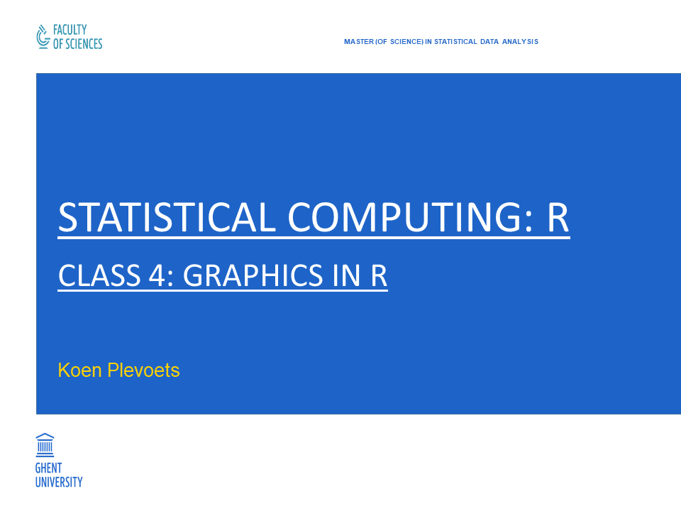
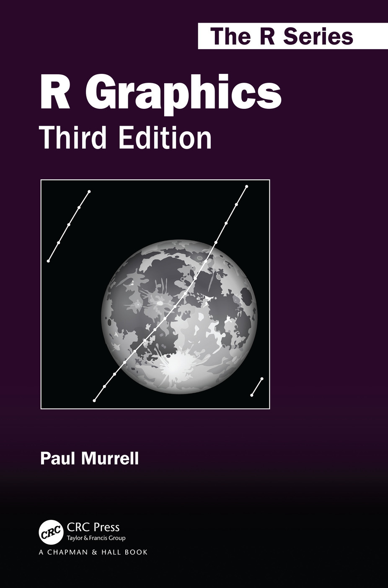

```{r setup, include=FALSE}
knitr::opts_chunk$set(collapse = TRUE, highlight = FALSE)
```

---

```{r cover, echo=FALSE, fig.align="center", out.width="85%"}

```

## Class 4: Graphics in R

- Chapter 10: **Graphics in R**
    - 10.1: **Base graphics**
    - 10.2: **Trellis graphics with lattice**
    - 10.3: **Grammar of Graphics with ggplot2**

## 10. Graphics in R

- The **standard reference** for **graphics in R** is Murrell (2019) _R Graphics. Third Edition_.
- Accompanying website: https://www.stat.auckland.ac.nz/~paul/RG3e/.

---

```{r murrell, echo=FALSE, fig.align="center", out.width="40%"}

```

## 10. Graphics in R

- The **graphics engine** in R is controlled by the (core) R package **grDevices**:
  - Low-level functions for colors, fonts, line types etc.
  - Functions for output formats: pdf, png etc.
- Based/Built on the **grDevices** package are packages for **graphics systems**:
  - **graphics**
  - **grid**
- Graphics systems contain high-level functions for making plots.

## 10. Graphics in R

- The **graphics** package is the core package for R's "base graphics".
- The **grid** package contains low-level functions that are used by other packages:
  - **lattice**
  - **ggplot2**
- The **graphics** and **grid** packages are **incompatible**:
  - You cannot (easily) modify a plot from the one package with the functions from the other package.
  - Hence, you have to convert plots with the packages **gridBase** and **gridGraphics**.

## 10.1 Base graphics

- The **graphics** package is automatically loaded when you open R (as well as the **grDevices** package).
- R graphics apply the "**painter's model**" (Murrell 2019: 1):

```
New visual elemens are always put on top of existing visual elements
(potentially hiding the existing elements).
```

- This also means that existing elements **cannot be removed** after they have been visualized.

## 10.1 Base graphics

```{r examplePainter1}
galileo <- read.delim2("galileo.txt", sep = " ", encoding = "UTF-8")
galileo
```
```{r examplePainter2, eval=FALSE}
plot(galileo)
text(x = 1250, y = 300,
     label = "Horizontal Distance travelled\nin function of\nInitial Height")
```

---

<div class="columns-2">

```{r examplePainter3, echo=FALSE, fig.width=5}
plot(galileo)
```

```{r examplePainter4, echo=FALSE, fig.width=5}
plot(galileo)
text(x = 1250, y = 300,
     label = "Horizontal Distance travelled\nin function of\nInitial Height")
```

</div>

## 10.1 Base graphics

- The example also shows the difference between:
  - **High-level** plotting functions: draw up a new plot (e.g. `plot()`)
  - **Low-level** plotting functions: add visual elements to an existing plot (e.g. `text()`)
- The function `plot()`is the most versatile high-level plotting function (others: see later).
- Other low-level plotting functions:
  - `points()`
  - `lines()`
  - `legend()`
  - ...
- The following slide illustrates some low-level plotting functions (drawn from Murrell 2019: 85)

---

```{r exampleLowlevel, echo=FALSE, fig.align="center"}
knitr::include_graphics("https://www.stat.auckland.ac.nz/~paul/RG3e/custombase-primplot.png")
```

---

```{r exampleLines, eval=FALSE}
lines(galileo)
```

```{r exampleLines2, echo=FALSE, fig.dim=c(6,5), fig.align="center"}
plot(galileo)
text(x = 1250, y = 300,
     label = "Horizontal Distance travelled\nin function of\nInitial Height")
lines(galileo)
```

## 10.1 Base graphics

- The drawing of points and/or lines can also be controlled with the argument `type`: see `help(plot)`.
- R's default is a scatter plot (`type = "p"`).

```{r exampleType, eval=FALSE}
plot(galileo, type = "l")
plot(galileo, type = "b")
```

---

<div class="columns-2">

```{r exampleType2, echo=FALSE, fig.width=5}
plot(galileo, type = "l")
```

```{r exampleType3, echo=FALSE, fig.width=5}
plot(galileo, type = "o")
```

</div>

## 10.1 Base graphics

- The plot type also depends on the **type** or **class** of the data.
- E.g. a plot of tabulated frequencies produces a (horizontal) bar chart (`type = "h"`):

```{r exampleTableHist}
FRQ_h_d <- table(cut(galileo$h.d, breaks = c(0, 350, 450, 600)))
FRQ_h_d
```

```{r exampleTableHist2, eval=FALSE}
plot(FRQ_h_d)
```

---

```{r exampleTableHist3, echo=FALSE, fig.dim=c(6,5), fig.align="center", ref.label="exampleTableHist2"}

```

## 10.1 Base graphics

- COMPARE: the two-dimensional scatterplot of the `galileo` data was made by specifying a data frame (with two columns) as a single argument.
- The same plot can be made with:
  - A `formula` and a `data` argument.
  - Two numeric vectors as arguments `x` and `y`.

```{r exampleScatterAlt, eval=FALSE}
# Results not shown
plot(h.d ~ init.h, data = galileo)
plot(x = galileo$init.h, y = galileo$h.d)
```

- However, certain features (e.g. axis labels) may be different.

## 10.1 Base graphics

- The following three slides show what various **high-level plottings functions** produce with:
  - A single variable
  - Two variables
  - More than two variables
- These plots were drawn from Murrell (2019: 34-39).

---

```{r exampleSingleArgs, echo=FALSE, fig.align="center"}
knitr::include_graphics("https://www.stat.auckland.ac.nz/~paul/RG3e/simplebase-highoneplots.png")
```

---

```{r exampleDoubleArgs, echo=FALSE, fig.align="center", out.width="45%"}
knitr::include_graphics("https://www.stat.auckland.ac.nz/~paul/RG3e/simplebase-hightwoplots.png")
```

---

```{r exampleMultipleArgs, echo=FALSE, fig.align="center"}
knitr::include_graphics("https://www.stat.auckland.ac.nz/~paul/RG3e/simplebase-highmanyplots.png")
```

## 10.1 Base graphics

- The output of graphical functions can be customized with **graphical parameters**:
  - **Temporarily** (for the current plot) as arguments to plotting functions.
  - **Persistently** (for all subsequent plots) with the function `par()`.
- All the graphical parameters define the "**graphics state**".
- Note:
  - Some functions have their own special arguments.
  - Some graphical parameters can only be set with the `par()` function.
  - Some graphical parameters are read-only.
- For the full list of graphical parameters, see `help(par)`.

## 10.1 Base graphics

- Colors are usually specified with the graphical parameter `col`.
- The **grDevices** package has various functions for creating color palettes:

```{r exampleColorPalettes, eval=FALSE}
plot(galileo, col = heat.colors(n = 7))
plot(galileo, col = topo.colors(n = 7))
```

---

<div class="columns-2">

```{r exampleColorPallettes2, echo=FALSE, fig.width=5}
plot(galileo, col = heat.colors(n = 7))
```

```{r exampleColorPalettes3, echo=FALSE, fig.width=5}
plot(galileo, col = topo.colors(n = 7))
```

</div>

## 10.1 Base graphics

- Line types are specified with the argument `lty` as either **integer codes** or **(character) names**.
- Line widths are specified with the argument `lwd`.

```{r exampleLinePars, eval=FALSE}
lines(galileo, lty = "dotdash")
lines(galileo, lty = 5, lwd = 2)
```

---

<div class="columns-2">

```{r exampleLinePars2, echo=FALSE, fig.width=5}
plot(galileo, col = heat.colors(n = 7))
lines(galileo, lty = "dotdash")
```

```{r exampleLinePars3, echo=FALSE, fig.width=5}
plot(galileo, col = topo.colors(n = 7))
lines(galileo, lty = 5, lwd = 3)
```

</div>

## 10.1 Base graphics

- The plotting symbol or "plotting character" is specified with the argument `pch`.
- All the information is given on the help page `help(points)`.

```{r examplePchPar, eval=FALSE}
plot(galileo, pch = 4)
```

---

```{r examplePchPar2, echo=FALSE, fig.dim=c(6,5), fig.align="center", ref.label="examplePchPar"}

```

## 10.1 Base graphics

- For fonts there is the distinction between **font families** and **font faces**.
- The font family is specified by the argument `family`:
  - Arial (`sans`), Times (`serif`) or Courier (`mono`)
  - A Hershey font: see `help("Hershey")`.
- The font face is specified by the argument `font`: an integer code for bold, italic etc.

```{r exampleFonts, eval=FALSE}
text(x = 1250, y = 300,
     label = "Horizontal Distance travelled\nin function of\nInitial Height",
     family = "serif")
text(x = 1150, y = 300,
     label = "Horizontal Distance travelled\nin function of\nInitial Height",
     family = "mono", font = 2)
```

---

<div class="columns-2">

```{r exampleLineFonts2, echo=FALSE, fig.width=5}
plot(galileo, pch = 4)
text(x = 1250, y = 300,
     label = "Horizontal Distance travelled\nin function of\nInitial Height",
     family = "serif")
```

```{r exampleLineFonts3, echo=FALSE, fig.width=5}
plot(galileo, pch = 4)
text(x = 1150, y = 300,
     label = "Horizontal Distance travelled\nin function of\nInitial Height",
     family = "mono", font = 2)
```

</div>

## 10.1 Base graphics

- **Multi-panel plots** can be made in R with:
  - `mfrow` (graphical parameter): inserts single plots **along the rows** of the plot window, divided into rows and columns.
  - `mfcol` (graphical parameter): inserts single plots **along the columns** of the plot window, divided into rows and columns.
  - `layout()` (function): divides the plot window according to a **matrix of indexes**, with potentially _unequal_ plot regions.
- The `mfrow` and `mfcol` graphical parameters can only be used as arguments to the function `par()`.
- This will be illustrated by means of the `iris` dataset.

## 10.1 Base graphics

```{r exampleMfRow, eval=FALSE}
par(mfrow = c(2, 3))
plot(Sepal.Width ~ Sepal.Length, data = iris)
plot(Sepal.Width ~ Petal.Length, data = iris)
hist(iris$Sepal.Width)
plot(Petal.Width ~ Sepal.Length, data = iris)
plot(Petal.Width ~ Petal.Length, data = iris)
hist(iris$Petal.Width)
```

---

```{r exampleMfRow2, echo=FALSE, fig.align="center", ref.label="exampleMfRow"}

```

## 10.1 Base graphics

```{r exampleMfCol, eval=FALSE}
par(mfcol = c(2, 3))
plot(Sepal.Width ~ Sepal.Length, data = iris)
hist(iris$Sepal.Length)
plot(Petal.Width ~ Petal.Length, data = iris)
hist(iris$Petal.Length)
plot(iris$Species)
```

---

```{r exampleMfCol2, echo=FALSE, fig.align="center", ref.label="exampleMfCol"}

```

## 10.1 Base graphics

```{r exampleLayout, eval=FALSE}
layout(rbind(c(1, 2), c(3, 3)))
plot(Sepal.Width ~ Sepal.Length, data = iris)
plot(Petal.Width ~ Petal.Length, data = iris)
plot(iris$Species)
```

---

```{r exampleLayout2, echo=FALSE, fig.align="center", ref.label="exampleLayout"}

```

## 10.1 Base graphics

- Multi-panel plots also clarify the three "regions" which every R plot has:
  - The **outer margins**
  - The **figure region**
  - The **plot region**
- This can be illustrated by the next slide, again drawn from Murrell (2019: 52).

---

```{r exampleThreeRegions, echo=FALSE, fig.align="center", out.width="55%"}
knitr::include_graphics("https://www.stat.auckland.ac.nz/~paul/RG3e/custombase-baseregionsnfig.png")
```

## 10.1 Base graphics

- The whole plot window is also called the **device region**.
- For a single plot, the outer margins are `0`.
- The area without the outer margins (i.e. the total area of all figure regions) is called the **inner region**.
- The plot region is the figure region without the **figure margins**.

## 10.1 Base graphics

- One of the most confusing aspects of base graphics are the many **coordinate systems** for handling these regions and margins.
- Everything **inside** the plot region is defined in "**user coordinates**":
  - Specified by the graphical parameters `xlim` and `ylim`.
  - In turn, these specify the `usr` parameter.
- The other regions and margins can be specified by various parameters **only one of which can be used**: the remaining parameters are set automatically (see next slide).

## 10.1 Base graphics

- Outer margins:
  - `oma`: a vector of four numbers (bottom, left, top, right) where each number stands for **lines of text**.
  - `omi`: a vector of four numbers (bottom, left, top, right) where each number stands for **inches**.
  - `omd`: a vector of four numbers (left, right, bottom, top) where each number stands for a **proportion of the device region (plot window)**.
- Figure region:
  - `fig`: a vector of four numbers (left, right, bottom, top) where each number stands for a **proportion of the inner region**.
  - `fin`: a vector of two numbers (width and height) where each number stands for **inches**.

## 10.1 Base graphics

- Figure margins:
  - `mar`: a vector of four numbers (bottom, left, top, right) where each number stands for **lines of text**.
  - `mai`: a vector of four numbers (bottom, left, top, right) where each number stands for **inches**.
- Plot region:
  - `plt`: a vector of four numbers (left, right, bottom, top) where each number stands for a **proportion of the figure region**.
  - `pin`: a vector of two numbers (width and height) where each number stands for **inches**.

## 10.1 Base graphics

- **3-D** graphics can be made with the package **rgl**.
- The functions `locator()` and `identify()` allow you to **interact** with a (coordinate on a) plot.

## 10.2 Trellis graphics with **lattice**

- The **lattice** package implements the **Trellis graphics** of Cleveland (1993).
- Its accompanying handbook is Sarkar (2008) _Lattice: Multivariate Data Visualization with R_.
- It is not automatically loaded, so you have to explicitly load it:

```{r exampleLatticeLoad}
library(lattice)
```

## 10.2 Trellis graphics with **lattice**

- The **lattice** package contains various high-level functions that build on the (low-level) functions of the **grid** package.
- The next slide presents each function name above its vizualization (again, drawn from Murrell 2019: 129).

---

```{r exampleLatticeHighLevel, echo=FALSE, fig.align="center", out.width="40%"}
knitr::include_graphics("https://www.stat.auckland.ac.nz/~paul/RG3e/simplegrid-latticeplots.png")
```

## 10.2 Trellis graphics with **lattice**

- The general syntax of **lattice** functions is the same as that of base graphics functions:

```{r exampleLatticeSyntax, eval=FALSE}
xyplot(Sepal.Width ~ Sepal.Length, data = iris,
       col = "blue", pch = 17)
```

- The **lattice** functions are formula-based.
- The arguments for graphical parameters have identical names.

---

```{r exampleLatticeSyntax2, echo=FALSE, fig.align="center", fig.dim=c(6,5), ref.label="exampleLatticeSyntax"}

```

## 10.2 Trellis graphics with **lattice**

- The same can be done with the argument `par.settings` which takes a **list of lists** as its value.
- The **lattice** package has **grouped** graphical parameters because some can apply to different plot components (e.g. `col`).

```{r exampleParSettings, eval=FALSE}
xyplot(Sepal.Width ~ Sepal.Length, data = iris,
       par.settings = list(plot.symbol = list(col = "blue", pch = 17)))
```

---

```{r exampleParSettings2, echo=FALSE, fig.align="center", fig.dim=c(6,5), ref.label="exampleParSettings"}

```

## 10.2 Trellis graphics with **lattice**

- There are two functions for managing the **graphics state**:
  - `trellis.par.get()`: retrieves the settings for (groups of) graphical parameters.
  - `trellis.par.set()`: specifies the settings for (groups of) graphical parameters.
- In other words, these are the equivalents of the `par()` function.

## 10.2 Trellis graphics with **lattice**

```{r exampleTrellisParGet}
# Overview of all parameter groups:
names(trellis.par.get())
```

## 10.2 Trellis graphics with **lattice**

```{r exampleTrellisParGetSub}
# Overview of all parameters in the group 'plot.line':
trellis.par.get("plot.line")
```

## 10.2 Trellis graphics with **lattice**

- A new feature of **lattice** functions is that they produce a **graphical object**.
- These are visualized by printing them:

```{r exampleLatticeObject}
plt <- xyplot(Sepal.Width ~ Sepal.Length, data = iris,
       col = "blue", pch = 17)
class(plt)
```

```{r exampleLatticePrint, eval=FALSE}
print(plt)
```

- This feature is based on the **grid** package.

---

```{r exampleLatticePrint2, echo=FALSE, fig.align="center", fig.dim=c(6,5), ref.label="exampleLatticePrint"}

```

## 10.2 Trellis graphics with **lattice**

- The **lattice** package is well-known for its visualization of **grouped data**.
- For instance, a traditional way is by means of a legend:
  - The argument `group` specifies the grouping variable.
  - The argument `auto.key` further specifies where the legend should be placed.

```{r exampleLatticeLegend, eval=FALSE}
xyplot(Sepal.Width ~ Sepal.Length, data = iris,
       group = Species, auto.key = list(space = "right"))
```

---

```{r exampleLatticeLegend2, echo=FALSE, fig.align="center", fig.dim=c(6,5), ref.label="exampleLatticeLegend"}

```

## 10.2 Trellis graphics with **lattice**

- However, the most famous way is **multi-panel conditioning**.
- The grouping variables are specified in the formula after a `|` symbol:
  - This separates the plot into different **panels** for the different group.
  - The group names (i.e. factor levels) are mentioned in the **strips** above each panel.

```{r exampleLatticeMulti, eval=FALSE}
xyplot(Sepal.Width ~ Sepal.Length | Species, data = iris)
```

- Continuous variables can be discretized with the function `shingle()`.

---

```{r exampleLatticeMulti2, echo=FALSE, fig.align="center", ref.label="exampleLatticeMulti"}

```

## 10.2 Trellis graphics with **lattice**

- The arrangement of panels can be controlled with the argument `layout`.
- It takes a vector of up to three values:
  - Number of **columns** in the plot window.
  - Number of **rows** in the plot window.
  - Number of **pages** of plot windows.

```{r exampleLatticeLayout, eval=FALSE}
xyplot(Sepal.Width ~ Sepal.Length | Species, data = iris,
       layout = c(2,2))
```

---

```{r exampleLatticeLayout2, echo=FALSE, fig.align="center", ref.label="exampleLatticeLayout"}

```

## 10.2 Trellis graphics with **lattice**

- Multi-panel plots can also be made with different figure regions (as in base graphics):
  - One creates a separate graphical object for every panel (e.g. using the argument `subset`).
  - One prints these graphical objects with the argument `position` (and `more`).
- Of course, this is not often done.

## 10.2 Trellis graphics with **lattice**

- In contrast to **lattice**'s flexibility, the **annotation** of the panels is quite complicated.
- It involves the creation of a **function** for the argument `panel`:
  - This **panel function** in turn consists of (high-level and low-level) functions prefixed by `panel.`.
  - These prefixed **panel components** are functions in the **lattice** package (and have help pages).

```{r exampleLatticePanelFun, eval=FALSE}
xyplot(Sepal.Width ~ Sepal.Length | Species, data = iris,
       panel = function(...) {
         panel.xyplot(...)
         panel.text(x = 7.5, y = 4.5, labels = "iris data")
         panel.grid()
       })
```

---

```{r exampleLatticePanelFun2, echo=FALSE, fig.align="center", ref.label="exampleLatticePanelFun"}

```

## 10.2 Trellis graphics with **lattice**

- If one want to apply the same function to every panel, then the panel function can have the general ellipsis argument `...`.
- However, if the panel function should depend on the data, then it can be specified with the (formal) arguments `x` and `y`:

```{r exampleLatticeLoess, eval=FALSE}
xyplot(Sepal.Width ~ Sepal.Length | Species, data = iris,
       panel = function(x, y, ...) {
         panel.xyplot(x, y, ...)
         panel.loess(x, y, ...)
       })
```

---

```{r exampleLatticeLoess2, echo=FALSE, fig.align="center", ref.label="exampleLatticeLoess"}

```

## 10.2 Trellis graphics with **lattice**

- For further annotation, there is the package **latticeExtra**.
- The **lattice** plots can also be modified with functions from the **grid** package, but this is usually not necessary.

## 10.3 Grammar of Graphics with **ggplot2**

- The **ggplot2** package implements Wilkinson (2005) _The Grammar of Graphics_.
- Its accompanying handbook is Wickham (2016) _ggplot2: Elegant Graphics for Data Analysis_.
- It is not automatically loaded, so you have to load it:

```{r exampleGgPlot2Load}
library(ggplot2)
```

## 10.3 Grammar of Graphics with **ggplot2**

- The **ggplot2** package builds on the **grid** package but it is **unrelated** to the **lattice** package.
- Its characteristical feature are the default settings for the graphical parameters:

```{r exampleQplot, eval=FALSE}
qplot(x = Sepal.Length, y = Sepal.Width, data = iris)
```

---

```{r exampleQplot2, echo=FALSE, fig.align="center", fig.dim=c(6,5), ref.label="exampleQplot"}

```

## 10.3 Grammar of Graphics with **ggplot2**

- Despite short-cut functions like `qplot()` or `quickplot()` the syntax of **ggplot2** is very different!
- E.g. the previous plot is typically made as:

```{r exampleGgPlot, eval=FALSE}
ggplot(data = iris) + geom_point(mapping = aes(x = Sepal.Length, y = Sepal.Width))
```

- This follows the **grammar of graphics** in which each plot is the **combination** of various plot **components** or **layers**:
  - Specify the **data (frame)** containing data values with the function `ggplot()`.
  - Specify the geometrical shapes, called **geoms**, of the visualization with functions like `geom_point()`, `geom_line()` etc.
  - Specify which properties of the geom, called **aesthetics**, represent the data with the function `aes()` and its arguments.

## 10.3 Grammar of Graphics with **ggplot2**

- In other words:

```
A plot in ggplot2 is created by mapping data values via aesthetics
to properties of the geoms.
```

- There is some flexibility in the use of the term "mapping":
  - Data values are mapped to aesthetics.
  - Aesthetics are mapped on data values.

## 10.3 Grammar of Graphics with **ggplot2**

- The different components or layers are **combined** with a `+` operator.
- If they all use the same aesthetics, then the mapping can also be declared immediately in the `gglot()` function:

```{r exampleGgPlotWithAes, eval=FALSE}
ggplot(data = iris, mapping = aes(x = Sepal.Length, y = Sepal.Width)) + geom_point()
# The same plot as before.
```

## 10.3 Grammar of Graphics with **ggplot2**

- Since **ggplot2** is based on the **grid** package, its functions also produce graphical objects which can be printed.
- Hence, the `+` operator enables the **incremental** building of graphical objects (before printing them):

```{r exampleGgPlotObject}
plt <- ggplot(data = iris, mapping = aes(x = Sepal.Length, y = Sepal.Width)) +
  geom_point()
class(plt)
```

```{r exampleGgPlotPrint, eval=FALSE}
print(plt)
```

---

```{r exampleGgPlotPrint2, echo=FALSE, fig.align="center", fig.dim=c(6,5), ref.label="exampleGgPlotPrint"}

```

## 10.3 Grammar of Graphics with **ggplot2**

- The **geom**s correspond to the various statistical charts:
  - `geom_point()`: Scatter plot
  - `geom_line()`: Line plot
  - `geom_bar()`: Bar chart
  - `geom_histogram()`: Histogram
  - `geom_density()`: Density curve
  - `geom_boxplot()`: Boxplot
  - `geom_contour()`: Contour plot
  - `geom_smooth()`: Smoothed plot
  - ...
- Each geom has its own aesthetics (see their help pages).
- All geoms have the aesthetics `color`, `size` and `group`.

---

```{r exampleGgPlot2Histogram, fig.align="center", fig.width=6, message=FALSE}
ggplot(data = iris, mapping = aes(x = Petal.Length)) + geom_histogram()
```

## 10.3 Grammar of Graphics with **ggplot2**

- When an aesthetic is specified inside the `aes()` function, it is **mapped** to data values.
- When an aesthetic is specified outside of the `aes()` function, it is **set** to a constant value.

```{r exampleGgPlot2MapSet1, eval=FALSE}
ggplot(data = iris) + 
  geom_point(mapping = aes(x = Sepal.Length, y = Sepal.Width, color = Species),
             size = 3)
```

```{r exampleGgPlot2MapSet2, eval=FALSE}
ggplot(data = iris) + 
  geom_point(mapping = aes(x = Sepal.Length, y = Sepal.Width, shape = Species),
             color = "blue", size = 2)
```

---

<div class="columns-2">

```{r exampleGgPlot2MapSet12, echo=FALSE, fig.align="center", fig.width=5, ref.label="exampleGgPlot2MapSet1"}

```

```{r exampleGgPlot2MapSet22, echo=FALSE, fig.align="center", fig.width=5, ref.label="exampleGgPlot2MapSet2"}

```

</div>

## 10.3 Grammar of Graphics with **ggplot2**

- Another layer (closely linked to geoms) are statistical transformations, called **stats**:
  - A histogram bins the data values before visualizing their counts.
  - A scatter plot uses the raw data values, which involves no transformation (i.e. the identity transformation).
- E.g. a histogram can be made as a bar chart of binned values (of a continuous variable):

```{r exampleGgPlot2Bin, eval=FALSE}
ggplot(data = iris, mapping = aes(x = Petal.Length)) + geom_bar() + stat_bin()
```

---

```{r exampleGgPlot2Bin2, echo=FALSE, fig.align="center", fig.dim=c(6,5), fig.keep="first", message=FALSE, ref.label="exampleGgPlot2Bin"}

```

## 10.3 Grammar of Graphics with **ggplot2**

- Equivalent syntax is:

```{r exampleGgPlot2BinEquivalent, eval=FALSE}
ggplot(data = iris, mapping = aes(x = Petal.Length)) + geom_bar(stat = "bin")
# Or:
ggplot(data = iris, mapping = aes(x = Petal.Length)) + stat_bin(geom = "bar")
```

- Every geom has a **default** stat: see next slide
- Each stat has its own argument: see their help pages.

---

 **Geom**            | **Default Stat**
:-------------------:|:-----------------:
 `geom_point()`      | **`stat_identity()`**
 `geom_line()`       | **`stat_identity()`**
 `geom_bar()`        | **`stat_count()`**
 `geom_histogram()`  | **`stat_bin()`**
 `geom_boxplot()`    | **`stat_boxplot()`**
 `geom_contour()`    | **`stat_contour()`**
 `geom_smooth()`     | **`stat_smooth()`**

## 10.3 Grammar of Graphics with **ggplot2**

- Because of the defaults for geoms and stats, the following commands are all equivalent:

```{r exampleGgPlot2LOESSLine, eval=FALSE}
ggplot(data = iris, mapping = aes(x = Sepal.Length, y = Sepal.Width)) +
  geom_smooth(method = "loess", se = FALSE)
ggplot(data = iris, mapping = aes(x = Sepal.Length, y = Sepal.Width)) +
  stat_smooth(method = "loess", se = FALSE)
# And to a lesser extent:
ggplot(data = iris, mapping = aes(x = Sepal.Length, y = Sepal.Width)) +
  geom_line(stat = "smooth", method = "loess")
```

- Of course, it is always possible to add a (smoothed) line to a scatter plot:

```{r exampleGgPlot2LOESScatter, eval=FALSE}
ggplot(data = iris, mapping = aes(x = Sepal.Length, y = Sepal.Width)) +
  geom_point() + stat_smooth(method = "loess")
```

---

<div class="columns-2">

```{r exampleGgPlot2LOESSLine2, echo=FALSE, fig.align="center", fig.width=5, fig.keep="first", message=FALSE, ref.label="exampleGgPlot2LOESSLine"}

```

```{r exampleGgPlot2LOESScatter2, echo=FALSE, fig.align="center", fig.width=5, ref.label="exampleGgPlot2LOESScatter"}

```

</div>

## 10.3 Grammar of Graphics with **ggplot2**

- The `group` aesthetic allows for the differentiation of groups:

```{r exampleGgPlot2Group, eval=FALSE}
ggplot(data = iris, mapping = aes(x = Sepal.Length, y = Sepal.Width)) +
  geom_point() + stat_smooth(mapping = aes(group = Species), method = "loess")
```

- However, this does not automatically add a legend, so it may be conventient to use another aesthetic (e.g. `color`):

```{r exampleGgPlot2GroupColor, eval=FALSE}
ggplot(data = iris, mapping = aes(x = Sepal.Length, y = Sepal.Width, color = Species)) +
  geom_point() + stat_smooth(method = "loess")
```

---

<div class="columns-2">

```{r exampleGgPlot2Group2, echo=FALSE, fig.align="center", fig.width=5, ref.label="exampleGgPlot2Group"}

```

```{r exampleGgPlot2GroupColor2, echo=FALSE, fig.align="center", fig.width=5, ref.label="exampleGgPlot2GroupColor"}

```

</div>

## 10.3 Grammar of Graphics with **ggplot2**

- Colors, plotting symbols ("shapes") line types etc. are determined by **ggplot2**'s default values.
- For **legends** these can be manipulated by a **scales** layer:
  - `scale_color_manual()` or `scale_colour_manual()`
  - `scale_shape_manual()`
  - `scale_size_manual()`
  - `scale_linetype_manual()`
  - `scale_fill_manual()`
  - ...

```{r exampleGgPlot2ColorManual, eval=FALSE}
ggplot(data = iris, mapping = aes(x = Sepal.Length, y = Sepal.Width, color = Species)) +
  geom_point() + stat_smooth(method = "loess") +
  scale_color_manual(values = c("red", "blue", "green3"))
```

---

```{r exampleGgPlot2ColorManual2, echo=FALSE, fig.align="center", fig.dim=c(7,5), ref.label="exampleGgPlot2ColorManual"}

```

## 10.3 Grammar of Graphics with **ggplot2**

- A **scales** layer is also used for **axis transformations**.
- In such cases, the scales layer **before** the geom layer ensures that all subsequent layers use the transformed values:

```{r exampleGgPlot2LogScale, eval=FALSE}
ggplot(data = iris, mapping = aes(x = Sepal.Length, y = Sepal.Width, color = Species)) +
  scale_x_continuous(trans = "log") +
  scale_y_continuous(trans = "log") +
  geom_point() + stat_smooth(method = "loess") +
  scale_color_manual(values = c("red", "blue", "green3"))
```

---

```{r exampleGgPlot2LogScale2, echo=FALSE, fig.align="center", fig.dim=c(7,5), ref.label="exampleGgPlot2LogScale"}

```

## 10.3 Grammar of Graphics with **ggplot2**

- In sum, the process flow in **ggplot2** is (drawn from Murrell 2019: 170):

```{r exampleGgPlot2Flow, echo=FALSE, fig.align="center"}
knitr::include_graphics("https://www.stat.auckland.ac.nz/~paul/RG3e/ggplot-diag4.png")
```

- This generalizes the orginal "data values are mapped via aesthetics to properties of geoms".
- As you see, there are also final **coordinate transformations** (done with `coord_trans()`) but we will not cover that here.

## 10.3 Grammar of Graphics with **ggplot2**

- Multi-panel plots can be made in **ggplot2** with the functions `facet_grid()` or `facet_wrap()`.
- Such plots are also called **small multiples**:

```{r exampleGgPlot2Facet, eval=FALSE}
ggplot(data = iris, mapping = aes(x = Sepal.Length, y = Sepal.Width)) + geom_point() +
  facet_wrap(facets = ~ Species)
```

---

```{r exampleGgPlot2Facet2, echo=FALSE, fig.align="center", ref.label="exampleGgPlot2Facet"}

```

## 10.3 Grammar of Graphics with **ggplot2**

- Labels can be added with the function `labs()`:

```{r exampleGgPlot2Labs, eval=FALSE}
ggplot(data = iris, mapping = aes(x = Sepal.Length, y = Sepal.Width)) + geom_point() +
  labs(title = "Width vs Length of Sepal Leaves")
```

- The presentation of all **non-data** elements is determined by the **theme**:
  - Individual elements can be customized with the function `theme()`: see its help page.
  - There are some predefined themes:

```{r exampleGgPlot2Theme, eval=FALSE}
ggplot(data = iris, mapping = aes(x = Sepal.Length, y = Sepal.Width)) + geom_point() +
  theme_dark()
```

---

<div class="columns-2">

```{r exampleGgPlot2Labs2, echo=FALSE, fig.align="center", fig.width=5, ref.label="exampleGgPlot2Labs"}

```

```{r exampleGgPlot2Theme2, echo=FALSE, fig.align="center", fig.width=5, ref.label="exampleGgPlot2Theme"}

```

</div>
