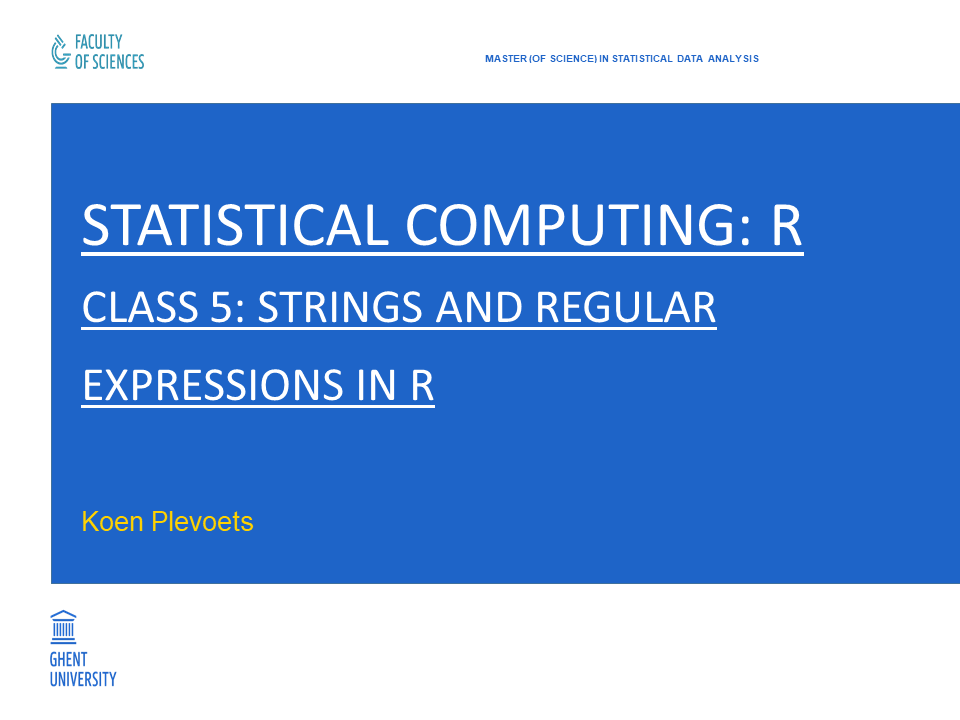
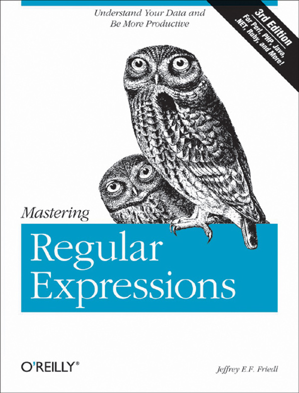

```{r setup, include=FALSE}
knitr::opts_chunk$set(collapse = TRUE, highlight = FALSE)
```

---

```{r cover, echo=FALSE, fig.align="center", out.width="85%"}

```

## Class 5: Strings and regular expressions in R

- Chapter 11: **Strings and regular expressions in R**
    - 11.1: **String processing in R**
    - 11.2: **Regular expressions in R**

## 11.1 String processing in R

- R has many base functions for string processing.
- All of them are **vectorized**, which makes them very fast.

## 11.1 String processing in R

- DEFINITION:
  - A **string** is a **value** made up of characters, wrapped/enclosed in quotation marks.
  - A **character vector** is a **vector** of **string values**.
- The difference is blurred in R because single strings are stored as character vectors of one element:

```{r exampleStrChr}
str1 <- "Rose"
str1
vec2 <- c("What's", "in", "a", "name?")
vec2
```

## 11.1 String processing in R

```{r exampleNcharLength}
# Note the difference between the function 'nchar()' and 'length()':
nchar(str1)
nchar(vec2)
length(str1)
length(vec2)
```

## 11.1 String processing in R

- The function `paste()` "glues" or concatenates the elements of vectors together.
- The arguments `sep` and `collapse` specify the string used as "**gluing** string", i.e. "**separator**".
- The use of the `collapse` argument returns a single string (i.e. a character vector with one element):

```{r exampleCollapse}
paste(vec2, collapse = "__")
vec3 <- paste(vec2, collapse = " ")
vec3
length(vec3)
```

## 11.1 String processing in R

- The use of the `sep` argument returns a **vector** by pasting the elements of several vectors in a **vectorized** way:

```{r exampleSep}
vec4 <- c("purple", "blue", "orange")
vec5 <- c("morning", "afternoon", "evening")
vec6 <- paste(vec4, vec5, sep=" in the ")
vec6
```

- In other words, this is:

$$
\small
paste \left(
\begin{bmatrix} `r vec4[1]` \\ `r vec4[2]` \\ `r vec4[3]` \end{bmatrix}
,
\begin{bmatrix} `r vec5[1]` \\ `r vec5[2]` \\ `r vec5[3]` \end{bmatrix}
,
sep = \begin{bmatrix} in\;the \\ in\;the \\ in\;the \end{bmatrix}
\right)
=
\begin{bmatrix} `r gsub(" ", "\\;", vec6, fixed=TRUE)[1]` \\
`r gsub(" ", "\\;", vec6, fixed=TRUE)[2]` \\
`r gsub(" ", "\\;", vec6, fixed=TRUE)[3]`  \end{bmatrix}
\normalsize
$$

## 11.1 String processing in R

```{r exampleSepCollapse}
# The arguments 'sep' and 'collapse' can also be used together:
str2 <- paste(vec4, vec5, sep=" in the ", collapse=", ")
str2
length(str2)
nchar(str2)
```

## 11.1 String processing in R

- The function `strsplit()` does the reverse of `paste()`: it splits each vector element on a separator.
- The separator is specified by the argument `split`.
- The splitted vectors can in principle have different lengths, so `strsplit()` returns them in a **list**:

```{r exampleStrsplit}
strsplit(vec6, split = " ")
```

- The `split` argument can also take a **regular expression**: see 11.2.

## 11.1 String processing in R

- The functions `substr()` or `substring()` extract **substrings** on the basis of a **start**/**first** and **stop**/**last** index:

```{r exampleSubstrIng}
substr(vec6, start = c(8,6,8), stop = c(21,21,21))
substring(vec6, first = c(8,6,8), last = c(21,21,21))
```

- This is again a result of vectorized computing:

$$
\small
substr(ing) \left(
\begin{bmatrix} `r gsub(" ", "\\;", vec6, fixed=TRUE)[1]` \\
`r gsub(" ", "\\;", vec6, fixed=TRUE)[2]` \\
`r gsub(" ", "\\;", vec6, fixed=TRUE)[3]` \end{bmatrix}
,
\begin{bmatrix} `r 8` \\ `r 6` \\ `r 8` \end{bmatrix}
,
\begin{bmatrix} `r 21` \\ `r 21` \\ `r 21` \end{bmatrix}
\right)
=
\begin{bmatrix}
`r gsub(" ", "\\;", substr(vec6,c(8,6,8),c(21,21,21)), fixed=TRUE)[1]` \\
`r gsub(" ", "\\;", substr(vec6,c(8,6,8),c(21,21,21)), fixed=TRUE)[2]` \\
`r gsub(" ", "\\;", substr(vec6,c(8,6,8),c(21,21,21)), fixed=TRUE)[3]`
\end{bmatrix}
\normalsize
$$

## 11.1 String processing in R

- An obvious difference between the `substr()` and `substring()` function are the differing argument names (`start` and `stop` vs. `first` and `last`, respectively).
- Another difference is that `last` argument of the `substring()` function is **optional**:

```{r exampleSubstringLast}
substring(vec6, c(8,6,8))
```

- Yet another difference is that the `substring()` function performs **recycling** when its three arguments have unequal lengths.

## 11.1 String processing in R

- Both the `substr()` and the `substring()` function can also be used with **assignment** in order to **replace** substrings.
- However, if the replacements strings are longer than the specified substrings, then the original character values will be overwritten:

```{r exampleSubstrAssignment}
substr(vec6, c(8,6,8), c(21,21,21)) <- c("at dawn", "at noon", "at dusk")
vec6
substr(vec6, c(8,6,8), c(21,21,21)) <- "in the "
vec6
```

## 11.1 String processing in R

- The functions `startsWith()` and `endsWith()` test whether each vector element resp. starts or ends with a certain string.
- This string is called "**prefix**" or "**suffix**", respectively:

```{r exampleStartsEnds}
startsWith(vec6, prefix="orange")
endsWith(vec6, suffix="ing")
```

## 11.1 String processing in R

- The functions `tolower()` and `toupper()` convert character elements to lower case and upper case, respectively:

```{r exampleToLowerUpper}
tolower(vec6)
toupper(vec6)
```

- There is also a general function `casefold()` with a logical argument `upper` (default = `FALSE`):

```{r exampleCasefold}
casefold(vec6, upper = TRUE)
casefold(vec6, upper = FALSE)
```

## 11.1 String processing in R

```{r exampleStartsLower}
vec2
tolower(vec2)
toupper(vec2)
# Sometimes you have to use several functions together:
startsWith(vec2, prefix = "what") # Wrong or unexpected result
startsWith(tolower(vec2), prefix = "what") # Correct result
```

## 11.2 Regular expressions in R

- String processing can also be done with **regular expressions** or **regexes**.
- The idea is to go through a string/text to look for (sub)sequences that **match** a certain **pattern**.
- That pattern is the **regular expression** or **regex**.
- Regular expressions are difficult!

## 11.2 Regular expressions in R

- The **standard reference** for **regular expressions** is Friedl (2006) _Mastering regular expressions. Third edition_.
- Accompanying website: http://regex.info/book.html.

---

```{r friedl, echo=FALSE, fig.align="center", out.width="45%"}

```

## 11.2 Regular expressions in R

- Regular expressions have their own **syntax**:
  - **Literal characters** (e.g. `a`, `b`, `1`, `0`, ...) match themselves.
  - **Metacharacters** (e.g. `^`, `.`, `\s`, ...) denote special features. 
  - **Character classes** (e.g. `[aeiou]`, `[1-9]`, `[[:punc:]]`, ...) match **sets** of characters.
  - **Quantifiers** (e.g. `*`, `+`, `+?`, ...) match **repetitions** of sequences.
  - ...
- See `help(regex)`.

## 11.2 Regular expressions in R

- R also has many functions for handling regular expressions:
  - `grep()`
  - `grepl()`
  - `regexpr()`
  - `gregexpr()`
  - `regexec()`
  - `regmatches()`
  - `sub()`
  - `gsub()`
- We will start with `grep()` in order to introduce the syntax of regular expressions.

## 11.2 Regular expressions in R

- The first argument of `grep()` and all other functions is `pattern` which specifies the regular expression.
- This regular expression must be specified as a **string** (i.e. wrapped in quotes), which may clash with R's own syntax for strings: see later.
- R's functions for regular expressions are also **vectorized**: they look for matches in **each element** of a **character vector**.

## 11.2 Regular expressions in R

- By default, `grep()` returns the index of the vector elements in which it finds a match.
- As mentioned, literal characters in the regular expression match themselves:

```{r exampleGrep}
vec6
grep(pattern = "u", vec6)
grep(pattern = "noon", vec6)
```

## 11.2 Regular expressions in R

- The `grep()` function has a logical argument `value` to specify whether the matched value should be returned:

```{r exampleGrepValue}
grep(pattern = "u", vec6, value = TRUE)
```

- The `grep()` function also has a logical argument `invert` to specify whether the non-matches should be returned:

```{r exampleGrepInvert}
grep(pattern = "u", vec6, invert = TRUE)
grep(pattern = "u", vec6, value = TRUE, invert = TRUE)
```

- The other R functions do **not** have the arguments `value` or `invert`!

## 11.2 Regular expressions in R

- **Metacharacters** are characters with a special meaning in regular expressions.
- This is the full list of metacharacters with their meaning:

 **Metacharacter**   | **Meaning**
:-------------------:|:--------------------------------------------------
 `^`                 | Matches the **beginning** of the string.
 `$`                 | Matches the **end** of the string.
 `.`                 | Matches **every** character (except the newline).
 `|`                 | Specifies various **alternatives** to be matched.
 `\`                 | Specifies an **escaped character**.

## 11.2 Regular expressions in R

```{r exampleMetacharacters}
grep(pattern = "^u", vec6, value = TRUE)
grep(pattern = "^p", vec6, value = TRUE)
grep(pattern = "ing$", vec6, value = TRUE)
grep(pattern = "in$", vec6, value = TRUE)
```

## 11.2 Regular expressions in R

```{r exampleMetacharacters2}
grep(pattern = ".", vec6, value = TRUE) # Matches every character in every element.
str3 <- ""
grep(pattern = ".", str3, value = TRUE)
grep(pattern = "afternoon|evening", vec6, value = TRUE)
grep(pattern = "ur|ue", vec6, value = TRUE)
```

## 11.2 Regular expressions in R

- The backslash `\` is the metacharacter for "escaping" characters.
- One of its uses is to match a character which otherwise would have been a metacharacter: e.g. `\.` to match a literal `.`.
- There are also special escape characters, which can in turn be distinguished (see next two slides):
  - **Non-negated** escape characters 
  - **Negated** escape characters

## 11.2 Regular expressions in R

 **Metacharacter**    | **Meaning**
:--------------------:|:------------------------------------------------------------------------------------------------
  `\d`                | Matches one of ten numeric digits `[0-9]`.
  `\s`                | Matches a whitespace.
  `\w`                | Matches a "word" character, i.e. any alphanumeric character or an underscore.
  `\b`                | Matches a word "boundary", i.e. the (empty) position between a word character and a whitespace.

## 11.2 Regular expressions in R

 **Metacharacter**   | **Meaning**
:-------------------:|:------------------------------------------------------------------------------------------------
  `\D`               | Matches ANYTHING BUT one of ten numeric digits `[0-9]`.
  `\S`               | Matches ANYTHING BUT a whitespace.
  `\W`               | Matches ANYTHING BUT a "word" character.
  `\B`               | Matches ANYTHING BUT a word "boundary".

## 11.2 Regular expressions in R

- A problem with the `\` metacharacter is that R **already** uses `\` for escaping characters in strings: e.g. `\n`, `\t`, etc.
- Because the regular expression itself has to be specified as a string, the **metacharacter** `\` has to be **escaped** itself.
- Hence, in order to specify escaped characters, the `\` has to be doubled:

```{r exampleDoubleEscape}
grep(pattern = "\\w", vec6, value = TRUE)
grep(pattern = "\\D", vec6, value = TRUE)
```

## 11.2 Regular expressions in R

```{r exampleDoubleEscape2}
vec7 <- c("one", "two", "3", "4")
grep(pattern = "\\d", vec7, value = TRUE)
vec8 <- c("hello?", "goodbye.") # Escape an otherwise metacharacter.
grep(pattern = "\\.", vec8, value = TRUE)
```

## 11.2 Regular expressions in R

- Another possibility is to set the argument `fixed` to `TRUE`, specifying that every character in the regular expression has to be interpreted literally.
- This makes sense if the strings in the character vector already contain escaped characters:

```{r exampleFixed}
grep(pattern = ".", vec8, value = TRUE, fixed = TRUE)
vec9 <- c("hello goodbye", "goodbye\nhello")
grep(pattern = "\n", vec9, value = TRUE, fixed = TRUE)
```

- All the other R functions for regular expressions also have the argument `fixed`.

## 11.2 Regular expressions in R

- A **character class** is specified with (the metacharacters) `[ ]`.
- It is used to match a **member** of a **set** of characters.
- E.g. to match a `p` **or** a `b`:

```{r exampleCharacterClass}
grep(pattern = "[pb]", vec6, value = TRUE)
```

- E.g. to match a `t` **or** a `3`:

```{r exampleCharacterClass2}
grep(pattern = "[t3]", vec7, value = TRUE)
```

## 11.2 Regular expressions in R

- A **range** of characters can be denoted with a `-`:

```{r exampleCharacterRange}
grep(pattern = "[a-z]", vec7, value = TRUE)
grep(pattern = "[0-9]", vec7, value = TRUE)
```

- Any metacharacter inside a character class matches the **literal** character:

```{r exampleLiteralMetacharacter}
grep(pattern = "[.]", vec8, value = TRUE)
grep(pattern = "[\n]", vec9, value = TRUE)
```

- In order words, this can be an alternative for the argument `fixed`.

## 11.2 Regular expressions in R

- A character class can also be **negated** with a `^` just after `[`:

```{r exampleNegatedClass}
grep(pattern = "[^a-z]", vec7, value = TRUE)
grep(pattern = "[^0-9]", vec7, value = TRUE)
grep(pattern = "[^A-Z]", vec7, value = TRUE) # Regular expressions are case sensitive!
```

- Hence, note the **different meaning** of `^` inside and outside of `[ ]`!

## 11.2 Regular expressions in R

- There are certain predefined character classes: see the full list on the next two slides.
- Their **names** are denoted with `[: :]` but they become character classes when **wrapped within** `[ ]`.

## 11.2 Regular expressions in R

 **Metacharacter**  | **Meaning**
:------------------:|:------------------------------------------------------------------------------------------------
  `[:alnum:]`       | Matches any alphanumeric character, i.e. is the union of `[:alpha:]` and `[:digit:]`.
  `[:alpha:]`       | Matches any alphabetic character, i.e. is the union of `[:lower:]` and `[:upper:]`.
  `[:blank:]`       | Matches any blank character, i.e. is the union of a space and a tab.
  `[:cntrl:]`       | Matches any control character.
  `[:digit:]`       | Matches any digit, i.e. is identical to `[0-9]` or `\d`.
  `[:graph:]`       | Matches any graphical character, i.e. is the union of `[:alnum:]` and `[:punct:]`.

## 11.2 Regular expressions in R

 **Metacharacter**  | **Meaning**
:------------------:|:------------------------------------------------------------------------------------------------
  `[:lower:]`       | Matches any lower-case letter, i.e. is identical to `[a-z]`.
  `[:print:]`       | Matches any printable character, i.e. is the union of `[:graph:]` and space.
  `[:punct:]`       | Matches any punctuation character.
  `[:space:]`       | Matches any space character, i.e. is the union of newline, tab, vertical tab, form feed, carriage return and space.
  `[:upper:]`       | Matches any upper-case letter, i.e. is identical to `[A-Z]`.
  `[:xdigit:]`      | Matches any hexadecimal character.

## 11.2 Regular expressions in R

```{r examplePredefinedClass}
grep(pattern = "[[:digit:]]", vec7, value = TRUE)
grep(pattern = "[^[:digit:]]", vec7, value = TRUE)
```

## 11.2 Regular expressions in R

- **Quantifiers** match **repetitions** of characters.
- They apply to the element **immediately before it**:

 **Quantifier**   | **Meaning**
:----------------:|:-----------------------------------------------------------------------------------------
  `?`             | Matches **zero or one** occurrence of the element before it.
  `*`             | Matches **zero or more** occurrences of the element before it.
  `+`             | Matches **one or more** occurrences of the element before it.
  `{n}`           | Matches **exactly `n`** occurrences of the element before it.
  `{n,}`          | Matches **`n` or more** occurrences of the element before it.
  `{n,m}`         | Matches **at least `n` and at most `m`** occurrences of the element before it.

## 11.2 Regular expressions in R

```{r exampleQuantifiers}
grep(pattern = "o{2}", vec6, value = TRUE)
vec10 <- c("hi", "hiiiii", "ho")
grep(pattern = "hi?", vec10, value = TRUE)
grep(pattern = "hi*", vec10, value = TRUE)
grep(pattern = "hi+", vec10, value = TRUE)
```

## 11.2 Regular expressions in R

- Whole sequences of characters can be **grouped** with `( )`:

```{r exampleGrouping}
vec11 <- c("hi", "hihihi", "ho", "hohoho", "")
grep(pattern = "(hi)?", vec11, value = TRUE)
grep(pattern = "(hi)*", vec11, value = TRUE)
grep(pattern = "(hi)+", vec11, value = TRUE)
```

- The `( )` can also be used to retrieve/"capture" the individual subsequence (see later).

## 11.2 Regular expressions in R

- By setting the argument `perl` to `TRUE`, we can use advanced regex features: see http://www.pcre.org/.
- One of them is **lookaround**:

 **Operator**   | **Meaning**
:--------------:|:------------------------------------------------------------------------------------------------
  `(?= )`       | Matches any string **followed by** what is **between** `(?= )`.
  `(?! )`       | Matches any string **not followed by** what is **between** `(?! )`.
  `(?<= )`      | Matches any string **preceded by** what is **between** `(?< )`.
  `(?<! )`      | Matches any string **not preceded by** what is **between** `(?<! )`.

## 11.2 Regular expressions in R

```{r exampleLookaround}
vec12 <- c("hi", "hihi", "hiho", "hohi", "hoho")
grep(pattern = "hi(?=ho)", vec12, value = TRUE, perl = TRUE)
grep(pattern = "hi(?!ho)", vec12, value = TRUE, perl = TRUE)
grep(pattern = "(?<=hi)ho", vec12, value = TRUE, perl = TRUE)
grep(pattern = "(?<!hi)ho", vec12, value = TRUE, perl = TRUE)
```

## 11.2 Regular expressions in R

- Other features can be illustrated with the other R functions.
- The function `grepl()` returns **logical values** for the vector elements in which it finds a match:

```{r exampleGrepL}
vec6
grepl(pattern = "u", vec6)
# Compare:
grep(pattern = "u", vec6)
```

- That means that both `grep()` (with `value = FALSE`) and `grepl()` can be used as **index vectors** for the original character vector.

## 11.2 Regular expressions in R

- The function `regexpr()` returns the **(integer) character position** of the **first match** it finds in **each vector element**.
- It returns `-1` for no match.
- The output also contains some attributes, the most important of which is `match.length`: the number of character of each match:

```{r exampleRegexpr}
regexpr(pattern = "u", vec6)
```

- The (sub)strings **corresponding** to those matches can be retrieved/replaced with the function `regmatches()`: see later.

## 11.2 Regular expressions in R

```{r exampleRegexpr2}
# The 'regexpr()' function does not find subsequent matches:
regexpr(pattern = "o", vec6)
# Compare: the second element has two occurrences of 'o':
vec6
```

## 11.2 Regular expressions in R

- The function `gregexpr()` returns the character position of **every occurrence** of a match.
- Hence, its output is a **list** with a component for every vector element.
- The following output, therefore, does not fit the slide:

```{r exampleGregexpr}
gregexpr(pattern = "o", vec6)
```

## 11.2 Regular expressions in R

- The function `regexec()` returns the character position of every **first match** in a **list**.
- The difference is that `regexec()` also returns the character positions of every **sequence between** `( )`!
- The following output, again, does not fit the slide:

```{r exampleRegexec}
regexec(pattern = "o", vec6)
```

## 11.2 Regular expressions in R

```{r exampleRegexeCapture}
str4 <- "hohiho"
regexec(pattern = "hi(ho)", str4)
```

## 11.2 Regular expressions in R

- The reason why `regexec()` works this way is that `( )` actually perform **two operations**:
  - They **group** a sequence of characters (as mentioned).
  - They retrieve/"capture" matches for these sequences **separately**.
- This is why `( )` are called "**capturing parentheses**" in regular expressions.
- The **non-capturing parentheses** (i.e. which only group sequences) are `(?: )` (with `perl = TRUE`).
- Because capturing parentheses store separate matches in memory, they can make your computer slower.

## 11.2 Regular expressions in R

- The function `regexpr()` and `gregexpr()` (but not `regexec()`) also allow for giving **names** to captured subsequences (with `perl = TRUE`).
- This is called "**named capture**".
- The operator is `(?< > )` where one writes a sequence of graphical characters between the `< >`, which will be the name.
- The information about the names is contained in extra attributes.

## 11.2 Regular expressions in R

```{r exampleNamedCapture}
# Two names: 'part1' and 'part2'
regexpr(pattern = "(?<part1>hi)(?<part2>ho)", str4, perl = TRUE)
```

## 11.2 Regular expressions in R

- The functions `regexpr()`, `gregexpr()` and `regexec()` can conveniently be used together with the function `regmatches()`.
- It returns the actual **(sub)strings corresponding** to the character positions:
  - Its first argument is the original character vector.
  - Its second argument is the object returned by `regexpr()`, `gregexpr()` or `regexec()`:

```{r exampleRegmatches}
reg1 <- regexpr(pattern = "u", vec6)
regmatches(vec6, reg1)
```

## 11.2 Regular expressions in R

```{r exampleRegmatches2}
reg2 <- gregexpr(pattern = "o", vec6)
regmatches(vec6, reg2)
```

- The `regmatches()` function also has a logical argument `invert` for returning the non-matches.
- The `regmatches()` function can be used with **assignment** to replace the (sub)strings.

## 11.2 Regular expressions in R

- The typical functions for **replacement** are `sub()` and `gsub()`.
- They replace a match of one regular expression by another.
- That means that both functions have a second argument `replacement` (besides `pattern`).
- The `sub()` function only replaces the **first match** found, the `gsub()` function replaces **every match**:

```{r exampleSubG}
sub(pattern = "o", replacement = "u" , vec6)
gsub(pattern = "o", replacement = "u" , vec6)
```

## 11.2 Regular expressions in R

- The functions `sub()` and `gsub()` also enable a special use of `( )`and `\` **together**.
- This is called "**backreferences**":
  - When the first regular expression (specified by `pattern`) contains **one or more** (capturing) `( )`, then their matches are **ordered** by the escape characters `\1`, `\2`, etc.
  - These escape characters can be used to **copy** the matches in the second regular expression (specified by `replacement`).
- E.g. to put a hyphen between `ho` and `hi`: 

```{r exampleBackreferences}
gsub(pattern = "(ho)(hi)", replacement = "\\1-\\2", str4)
```

## 11.2 Regular expressions in R

- In order to fully understand regular expressions, we finally zoom in on the "mechanics of the regex engine".
- What actually happens when the regular expression `hi(hi)?` is matched against the string `hohiho`?

```{r exampleMechanics}
str4
regexpr(pattern = "hi(hi)?", str4)
```

## 11.2 Regular expressions in R

- The R engine uses some principles to process the string matching:
  - It starts with the first character in the regular expression and then goes through the string to find a first match, then it does the same with the second character of the regular expression and so on.
  - In case of possible alternatives it returns the first match it finds.
  - ...
- E.g. the subsequent steps in matching the regex `hi(hi)?` against the string `hohiho` are:

```
- The regex engine starts with the first 'h' of the regex 'hi(hi)?' and compares it
  with the first 'h' of the string 'hohiho': it finds a match.
- It goes on with the first 'i' of 'hi(hi)?' and compares it with the the first 'o'
  of 'hohiho': it fails to find a match, so it BACKTRACKS.
  
... (continued on the next slide)
```

## 11.2 Regular expressions in R

```
- It shifts to the first 'o' of 'hohiho' and compares the first 'h' of 'hi(hi)?'
  with it: it does not find a match, so it shifts to the second 'h' of 'hohiho'
  (i.e. the 'h' on the third character position of 'hohiho').
- It compares the first 'h' of 'hi(hi)?' with that second 'h' of 'hohiho' and
  it finds a match.
- It now compares the first 'i' of 'hi(hi)?' with the first 'i' of 'hohiho'
  (i.e. on the fourth character position) and it finds a match.
- It enters the subsequence 'hi' quantified by '?' in 'hi(hi)? and compares
  its 'h' with with the third 'h' of 'hohiho' (on the fifth character position)
  and it finds a match.
- It compares the last 'i' of 'hi(hi)?' with the last 'o' of 'hohiho' and
  it fails to find a match, so it BACKTRACKS.
- The previously matched 'h' cannot remedy the failure, so this match is also
  undone.
- The regex engine is now in the state where it can choose to quantify the second
  'hi' of 'hi(hi)?' ZERO times (i.s.o. one time) which it does.

... (continued on the next slide)
```

## 11.2 Regular expressions in R

```
- With zero occurrences of the second, quantified 'hi' in 'hi(hi)?' it finds a match
  for the WHOLE regex 'hi(hi)?': starting at character position 3 of the string
  'hohiho' and counting 2 characters.
- Because it has found a match for the whole regex, it reports it.

- Functions like 'gregexpr()' and 'gsub()' would continue processing the string
  'hohiho' and REPEAT this whole procedure for the next character in line:
  i.e. compare the very first 'h' of 'hi(hi)?' with the 'h' on the fifth position
  of 'hohiho' and so on.
```

## 11.2 Regular expressions in R

- These principles underlie any situation where the regex engine has different alternatives: also character classes `[ ]` or alternation with `|`.
- They also mean that the **quantifiers** mentioned before are "**greedy**":
  - When given a choice, the regex engine tries to match **as many repetitions as possible**.
  - This comes down to trying to match a **repetition before** moving on to the **next regex element**.
- The quantifiers which match **as few repetitions as possible** are "**lazy**": see the next slide.

## 11.2 Regular expressions in R

 **Quantifier**    | **Meaning**
:-----------------:|:-----------------------------------------------------------------------------------------
  `??`             | Matches **zero or one** occurrence of the element before it, but **matching the next regex element before backtracking** to the repetition.
  `*?`             | Matches **zero or more** occurrences of the element before it, but **matching the next regex element before backtracking** to the repetition.
  `+?`             | Matches **one or more** occurrences of the element before it, but **matching the next regex element before backtracking** to the repetition.
  `{n,}?`          | Matches **`n` or more** occurrences of the element before it, but **matching the next regex element before backtracking** to the repetition.
  `{n,m}?`         | Matches **at least `n` and at most `m`** occurrences of the element before it, but **matching the next regex element before backtracking** to the repetition.

## 11.2 Regular expressions in R

- Compare the regular expression `hi(hi)+` with `hi(hi)+?` against the string `hohihihiho`: see the next slide.
- The **greedy** quantifier matches all six characters `hihihi`, the **lazy** quantifiers only matches `hihi` on the character positions 3-6.

## 11.2 Regular expressions in R

```{r exampleGreedyLazy}
str5 <- "hohihihiho"
regexpr(pattern = "hi(hi)+", str5)
regexpr(pattern = "hi(hi)+?", str5)
```

## 11.2 Regular expressions in R

- Finally, all R functions (except `regmatches()`) have a logical argument `ignore.case` to specify whether the regular expression should be case sensitive or not.
- There are also functions for **approximate string matching**:
  - `agrep()`
  - `agrepl()`
  - `aregexec()`
- Text files can be read in with the functions `readLines()` or `scan()`: see 8.1.

## Example: Word frequencies from text file

```{r exampleSonnet18}
son18 <- scan("sonnet18.txt", what=character(), encoding="UTF-8")
# Convert all characters to lower case.
# Replace all punctuation characters by the empty string.
# Punctuation characters can be repeated, so we have to quantify the character class:
son18 <- gsub(pattern="[[:punct:]]+", replacement="", tolower(son18))
frq18 <- table(son18)

# Or the same with slightly more code:
son18 <- readLines("sonnet18.txt", encoding="UTF-8", warn=FALSE)
son18 <- unlist(strsplit(tolower(son18), split=" "))
son18 <- gsub(pattern="[[:punct:]]+", replacement="", tolower(son18))
son18 <- son18[son18 != ""] # Remove empty string from character vector.
frq18 <- table(son18)
```
