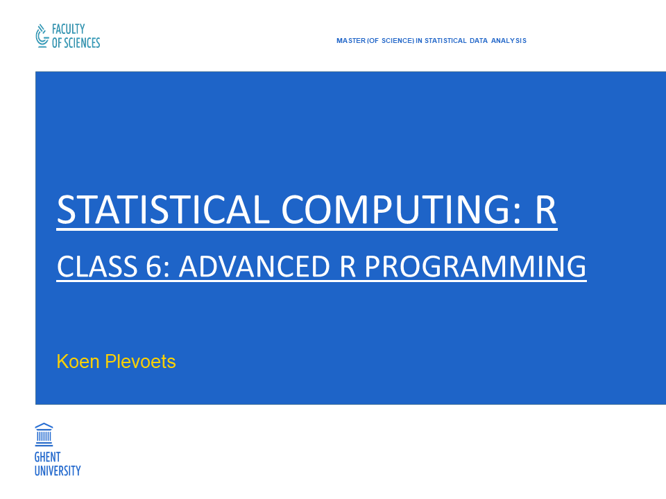

```{r setup, include=FALSE}
knitr::opts_chunk$set(collapse = TRUE, highlight = FALSE)
```

---

```{r cover, echo=FALSE, fig.align="center", out.width="85%"}

```

## Class 6: Advanced R Programming

- Chapter 12: **Computing on the language**
- Chapter 13: **Object-oriented programming**
    - 13.1: **S3**
    - 13.2: **S4**
    - 13.3: **RC**
- Chapter 14: **Debugging**
- Chapter 15: **Performance: speed and memory**

## 12. Computing on the language

- In line with Chambers' `Object` principle, **R commands** can **themselves** be treated as R objects.
- Such objects can be made with the function `quote()`, which returns an **unevaluated expression**:

```{r exampleQuote}
obj1 <- quote(1 + 2)
obj1
```

- These can then be evaluated with function `eval()` to produce the return value:

```{r exampleEval}
eval(obj1)
```

- The `eval()` function has some arguments to specify **environments**: see later.

## 12. Computing on the language

- The **type** of an unevaluated expression depends on what it refer to:
  - A **name** of (another) object has type `symbol`.
  - A **call** to a function has type `language`.

- Its **class** is simply another name for its type:
  - A **name** of (another) object has class `name`.
  - A **call** to a function has class `call`.

## 12. Computing on the language

```{r exampleExpressionTypes}
typeof(obj1)
class(obj1)
obj2 <- quote(bb)
obj2
typeof(obj2)
class(obj2)
```

## 12. Computing on the language

- The general term for names and calls is **expression**.
- There is a link with expressions made with the function `expression()`:
  - Remember form Class 1 that these are **vectors** of type `expression`.
  - More precisely, they are **recursive vectors** (like **lists**).
  - In fact, expressions are recursive vectors of names, calls and (sub)expressions.

## 12. Computing on the language

- Every R expression can be converted to a **list**:

```{r exampleAsList}
lst1 <- as.list(obj1)
lst1
```

- The **nesting** of the list represents the (recursive) structure of the expression:
  - The first list component is the **name** of the **function**.
  - The next list component**s** are the **arguments** of the function.
  - More complex expressions are represented with **sublists**.

## 12. Computing on the language

- Conversion to lists allows for the **editing** of expressions.
- Such a list can be converted (back) to an expression with `as.call()`:

```{r exampleEditedAsCall}
lst1[[3]] <- 3
obj3 <- as.call(lst1)
obj3
eval(obj3)
```

- Conversion to name objects can be done with the functions:
  - `as.name()`.
  - `as.symbol()`

## 12. Computing on the language

- Expressions can be built with **variables**, i.e. **names** which are bound elsewhere:

```{r exampleVariableExpression}
obj4 <- quote(aa + 3)
obj4
```

- If such a name is bound, then `eval()` can compute its return value:

```{r exampleVariableEval}
aa <- 5
eval(obj4)
```

## 12. Computing on the language

- By default, `eval()` looks in its **calling environment** for bindings (i.e. the environment in which `eval()` itself was called).
- However, the environment can also be specified with the argument `envir`.
- This allows for evaluating expressions in any chosen environment:

```{r exampleEvalEnvir}
env4 <- new.env()
env4$aa <- 7
ls.str(env4)
eval(obj4, envir = env4)
```

- This is called **non-standard evaluation (NSE)**.

## 12. Computing on the language

- Because environments have essentially the same syntax as lists, non-standard evaluation can also be done as follows:

```{r exampleEvalList}
eval(obj4, envir = list(aa = 7))
```

- This works because the list is (automatically) converted to an environment with the function `list2env()`.

## 12. Computing on the language

- If `eval()` does not find a binding in `envir`, then it will look in the **parent** of `envir`.
- Remember (from 5.3) that this is the environment in which `envir` was **created**.
- If any other environment is preferred, then it can be specified as the third argument `enclos`.

## 12. Computing on the language

- The function `substitute()` changes one expression into another by replacing **names** by **values**.
- The **bindings** of names to values need to specified as an environment to the argument `env`:

```{r exampleSubstitute}
obj5 <- substitute(aa + bb, env = list(aa = 3, bb = 5)) # Also uses 'list2env()'.
obj5
eval(obj5)
```

- Note that the first argument of `substitute()` needs to be an **unquoted** expression (i.e. just the expression itself without the `quote()` function)!

## 12. Computing on the language

- The function `parse()` converts a **string** to an (unevaluated) **expression**.
- The first argument of the `parse()` function is `file` (for reference to scripts), so a single string needs to be specified with the argument `text`:

```{r exampleParse}
obj6 <- parse(text = "3 + 4")
obj6
eval(obj6)
```

- The execution of an R script (e.g. with `source()`) in fact applies `parse()` to the output of `readLines()` (followed by `eval()`). 

## 12. Computing on the language

- The function `deparse()` reversely converts **expressions** to **strings**:

```{r exampleDeparse}
str7 <- deparse(quote(4 + 5))
str7
```

- Such strings can then be processed with **regular expressions** (see 11.2).

## 13. Object-oriented programming

- R has three important systems for **object-oriented programming (OOP)**:
  - **S3**
  - **S4**
  - **RC**
- The fullest, technical account of OOP in R is part III (pp. 129-240) of Chambers, John (2016) _Extending R_.

## 13. Object-oriented programming

- Chambers (2016) calls the **S3** and **S4** systems **functional OOP** because both systems just extend **R functions**:
  - R is essentially a **functional programming language**.
  - This is also why Chambers (2016: 7) calls R an **object-based** programming language (instead of an **object-oriented** programming language).
- The **RC** system is a full-blown **object-oriented** system, which is why Chambers (2016) refers to it as **encapsulated OOP**.

## 13.1 S3

- The **S3** system is:
  - the oldest
  - the easiest
  - the most flexible
  - still the most often used
- The reason is that everything happens with **R functions**.
- The flexibility also means that R will **not** raise a warning or error if you do something "non-OOP"!

## 13.1 S3

- Remember from Class 1 that **classes** can simply be created by assigning a value to the `class` attribute:

```{r exampleClassS3}
obj8 <- c(70, 30, 40, 60, 80)
class(obj8) <- "frabjous"
obj8
```

- Instances of such classes are usually created within a function (e.g. the following pseudo-code):

```{r exampleConstructorS3, eval=FALSE}
someFunction <- function(x, y, ...) {
  # Some computations
  class(out) <- "frabjous"
  out
}
```

## 13.1 S3

- Another way of designing such a **class constructor function** is with `structure()` (again, pseudo-code):

```{r exampleConstructor2S3}
someFunction <- function(x, y, ...) {
  # Some computations
  structure(out, class = "frabjous")
}
```

- Apart from this, there are no other requirements on the properties of **S3** classes:
  - In other words, "**S3 classes do not have a formal class definition**".
  - This contrasts with both **S4** and **RC** (see later).

## 13.1 S3

- With these classes, we can define **methods**:
  - These are **functions** which do some computation on the (data of the) class instance.
  - They are **particular to the class**.
- In order to use methods, we first need a **generic** function:
  - We can use an existing R generic if we want to adapt it for our class: e.g. `print()`, `summary()` etc.
  - We can create a new generic (see the next slide).

## 13.1 S3

- A **generic** function, or "generic" in short, always has the same definition:
  - We can choose its name ourselves (e.g. here we choose `pass()`).
  - Its body just needs to contain the function `UseMethod()` with the **generic name** again as its argument:

```{r exampleGenericS3}
pass <- function(x, ...) UseMethod("pass")
```

- The function `UseMethod()` does **method dispatch** in R:
  - It will look for a **function** which starts with the same name as the name between brackets (viz. `pass`).
  - But, it should have a specific definition for the **class** of argument `x`.
- This other function is the actual **method**.

## 13.1 S3

- A **method** is a function with a specific **function name**:
  - Its **first part** is the name of the **generic** (e.g. `pass`)
  - Then there is a **dot** (`.`).
  - Its **last part** is the name of the **class** (e.g. `frabjous`).
- The **body** of the methods contains the actual computational commands.
- E.g. a method which returns `TRUE` if a value is higher than or equtal to 50 and `FALSE` otherwise:

```{r exampleMethodS3}
pass.frabjous <- function(x) {
  x >= 50
}
```

## 13.1 S3

- With such a method, we do not have to type the part after the dot (`.`), but we can just type the generic:

```{r exampleDispatchS3}
pass(obj8)
```

- What happens, is:
  - Our call `pass(obj8)` executes the **generic** `pass()`.
  - The **generic** `pass()` executes the command `UseMethod("pass")`.
  - The command `UseMethod("pass")` performs **method dispatch**: it will (make R) look for another function starting with `pass` followed by a `.` followed by the class name of (formal) argument `x`, viz. `frabjous`.
  - Since we have defined the function `pass.frabjous()`, R finds it and executes it.

## 13.2 S4

- The **S4** system is available in the core package **methods**.
- **S4** requires you to create a **formal class definition**.
- Hence, you can never create a class instance that does not have all the necessary attributes.
- This is **less flexible** but **safer** than **S3**.

## 13.2 S4

- An **S4 class definition** is made with the function `setClass()`:
  - Its first argument specifies the **name** of the new class.
  - Its second argument `slots` specifies the **names** and **types** of the **attributes** of the class (called "**slots**").
  - Its optional third argument `contains` specifies the (super)class from which this new class will **inherit**.
- E.g a class `frabjous` with one (new) slot `callooh` and inheriting from `numeric`:

```{r exampleSetClassS4}
library(methods)
setClass("frabjous", slots = c(callooh = "character"), contains = "numeric")
```

## 13.2 S4

- You can also create a **class constructor** by using `setClass()` with **assignment**.
- It is good practice use the **same name** for the class and the class constructor:

```{r exampleConstructorS4}
frabjous <- setClass("frabjous", slots = c(callooh = "character"), contains = "numeric")
frabjous
```

## 13.2 S4

- After the class definition, you can create **class instances**, i.e. objects of the class:
  - With the class constructor
  - With the function `new()`
- With the class constructor:
  - You need to specify a value to every slot.
  - If the class inherits from another class, then the data values can be specified as the first argument:

```{r exampleInstanceS4}
obj9 <- frabjous(c(30, 40, 70, 70, 90), callooh = "callay")
obj9
```

## 13.2 S4

- If you did not create a class constructor (with assignment), then you can always use the function `new()`.
- Everything remains the same except that you specify the class name as the first argument:

```{r exampleNewInstanceS4}
obj10 <- new("frabjous", c(80, 80, 40), callooh = "noway")
obj10
```

- Of course, all values need to be of the proper type!

## 13.2 S4

- The values in the individual slots can be accessed:
  - With the operator `@`
  - With the function `slot()`

```{r exampleSlotS4}
obj9@callooh
slot(obj10, "callooh")
```

- In other words, `@` for **S4** objects is the same as `$` for **lists** or **environments**.
- The data values can be accessed with the special name `.Data`:

```{r exampleDataS4}
obj9@.Data
```

## 13.2 S4

- **Generics** and **methods** for **S4** classes can be created with the functions `setGeneric()` and `setMethod()`, respectively.
- An **S4 generic** is the combination of a **name** and a function for **method dispatch**:
  - Its first argument specifies the **name** of the generic.
  - Its second argument specifies an **anonymous** function containing the function `standardGeneric()` in its body (with the name of the generic again as its argument).

```{r exampleGenericS4}
setGeneric("pass2", function(x) standardGeneric("pass2"))
```

- In other words, `standardGeneric()` does for **S4** what `UseMethod()` does for **S3** (viz. **method dispatch**).

## 13.2 S4

- The `setMethod()` function for creating **S4 methods** takes three arguments:
  - Its first argument needs to specify the **same name** as the **generic**.
  - Its second argument `signature` specifies the **name** of the **class**.
  - Its third argument `definition` specifies the **function**.
- E.g. A method that returns `TRUE` when the data values are higher than or equal to 50 and `FALSE` otherwise:

```{r exampleMethodS4}
setMethod("pass2", "frabjous", function(x) x > 50)
```

## 13.2 S4

```{r exampleSummaryS4}
pass2(obj9)
# Compare:
obj9
```

- This shows that **S4** methods are **R functions**:
  - They are **used** as functions and return **another object**.
  - They do **not modify** the **S4** object (viz. `obj9`) itself.
- That is the difference with **RC** objects (see the next slide).

## 13.3 RC

- The **RC** system (short for "**reference classes**") is also available in the **methods** package.
- **RC**'s are a combination of **S4 classes** and **environments**.
- That gives rise to a full-fledged **object-oriented** system (which Chambers 2016 calls **encapsulated OOP**):
  - **RC** methods belong to **objects**, not functions.
  - **RC** objects are **mutable**: operations do not create a copy of the object but **modify** the object itself.

## 13.3 RC

- **RC**'s are made with the function `setRefClass()`.
- One difference with **S4** classes is that `slots` are called `fields` in **RC**.
- Another difference is that all fields must be declared:

```{r exampleClassRC}
library(methods)   # If not loaded yet
frabjousRC <- setRefClass("frabjousRC",
                          fields = c(data = "numeric", callooh = "character"))
```

- **RC**'s are typically made with a **class constructor**, which already has some predefined methods (see the next slide).

## 13.3 RC

```{r exampleConstructorRC}
frabjousRC
```

## 13.3 RC

- **Instances** of **RC**'s are made with the predefined method `$new()`.
- Note the `$` operator:

```{r exampleInstanceRC}
obj11 <- frabjousRC$new(data = c(40, 60, 60, 40, 70), callooh = "callay")
obj11
```

## 13.3 RC

- The values in individual fields can be accessed:
  - With the `$` operator
  - with the method `$field()`:

```{r exampleFieldRC}
obj11$data
obj11$field("callooh")
```

- There is **no function** `fields()` because that would go against the idea of encapsulated OOP.

## 13.3 RC

- **RC**'s are built on **environments**.
- That means that they use **reference semantics** (see 5.3):
  - If you modify a **copy** an **RC** object, then automatically also modify the **original** object.
  - This makes **RC** objects **mutable**:
  
```{r exampleMutableRC}
obj12 <- obj11
obj12$"callooh" <- "noway"
obj11
```

- If you want a separate object, then you have to use the method `$copy()`.

## 13.3 RC

- In line with encapsulated OOP, **RC methods** are created in the **class definition**, i.e. in the function `setRefClass()`.
- More specifically, **RC** methods are specified as a list to the argument `methods`.
- We also have to change the definition somewhat:
  - Because the data values a field (`data`) in our class (`frabjous`), we do **not** require them as a **formal argument**.
  - Instead, we specify the field in the body:

```{r exampleMethodRC}
frabjousRC <- setRefClass("frabjousRC",
                          fields = c(data = "numeric", callooh = "character"),
                          methods = list(pass = function () data >= 50))
```

## 13.3 RC

```{r exampleMethodResultRC}
obj11$pass()
# Compare:
obj11
```

## 13.3 RC

- Reference semantics also allow for **methods** which **modify** the **RC** object itself, i.e. illustrate **mutability**.
- Such methods require the use of the `<<-` operator in their body (see 5.2).
- E.g. a method which adds `x` to every value in `data`:

```{r exampleMutableMethodRC}
frabjousRC <- setRefClass("frabjousRC",
                          fields = c(data = "numeric", callooh = "character"),
                          methods = list(pass = function () data >= 50,
                                         add = function(x) data <<- data + x))
```

## 13.3 RC

```{r exampleMutableMethodResultRC}
obj11$add(x = 1)
obj11
```

## 3. Object-oriented programming

- Despite its quirkiness, **S3** is still used most often.
- Use **S4** if you have many classes and methods and you want to avoid problems.
- Use **RC** if you are accustomed to object-oriented programming:
  - Mutable objects are in fact **side effects** (see 5.2).
  - **Functional OOP** (of **S3** and **S4**) naturally follows the typical flow of a data analysis project.

## 14. Debugging

- When your script raises **errors** or **warnings**, you have to find the problem(s).
- This process of **debugging** is usually one of **trial and error**.
- However, you can also raise problems in your functions:
  - The function `stop()` raises an **error** which you specify.
  - The function `warning()` raises a **warning** which you specify.
  - The function `message()` raises an informative **message** which you specify.
- The functions `stop()` and `warning()` have a logical argument `call.` which specifies whether **meta-information** on the call should be added (by default, `TRUE`).

## 14. Debugging

```{r exampleMessages}
fun12 <- function(x) {
  if (x > 3) {
    stop("no, this number is too big!", call. = FALSE)
  }
}

fun13 <- function(x) {
  if (x > 3) {
    warning("watch out, this number may be too big!", call. = FALSE)
  }
}

fun14 <- function(x) {
  if (x > 3) {
    message("okay, but this number is rather big!")
  }
}
```

## 14. Debugging

```{r exampleMessages2, error=TRUE, warning=TRUE}
fun12(x = 4)
fun13(x = 4)
fun14(x = 4)
```

- There is also the function `stopifnot()` to raise an error if a certain condition is not met.
- Conditions can also be specified with the various functions for **condition handling**: see `help(conditions)`.

## 14. Debugging

- The usual way to debug R functions is to add the function `browser()` somewhere in the body.
- When the function is executed, the `browser()` function lets you **interact** with the function:
  - The execution is temporarily suspended.
  - You can inspect the (execution) environment of the call.

```{r exampleBrowser}
a <- 4
fun15 <- function(x) {
  b <- 5
  browser()
  x + a + b
}
```

## 14. Debugging

```{r exampleBrowser2, eval=FALSE}
fun15(x = 3)
## Called from: fun15(x = 3)
Browse[1]>
```

- In this browser, you can type the names of objects to see their values (e.g. `a` or `b`).
- You can type `c`, or `n` etc. to execute the remaining commands: see `help(browser)`.

## 14. Debugging

- The function `debug()` adds a `browser()` command at the beginning of a body.
- The function `undebug()` removes it (again).

```{r exampleDebug}
fun16 <- function(x) {
  y <- 4
  x + y
}
debug(fun16)
```

## 14. Debugging

```{r exampleDebug2, eval=FALSE}
fun16(x = 3)
## debugging in: fun16(x = 3)
## debug at #1: {
##    y <- 4
##    x + y
## }
Browse[1]>
```

```{r exampleUndebug}
undebug(fun16)
fun16(x = 3)
```

## 14. Debugging

- The function `debugonce()` combines `debug()` and `undebug()` for one call.
- The function `debugger()` and `recover()` provide even more flexibility...
- The function `traceback()` gives the **call stack** of **nested calls**:
  - This is the sequence of calls (in reverse order) up until the error.
  - This is rarely useful.

## 15. Performance: speed and memory

- The performance of R computations can be an issue because R stores many objects in **working memory**: see `help(Memory)`.
- There are some functions which help you measure performance:
  - The function `system.time()` returns the **execution time** of R code.
  - The function `object.size()` returns the **byte size** of an R object.
- For very heavy computations, you can make use of some R packages.

## 15. Performance: speed and memory

```{r exampleSystemtime1}
obj17 <- 1:100000
```

```{r exampleSystemtime2, eval=FALSE}
# E.g. comparison between a 'for' loop and 'lapply()':
system.time(
  for (i in obj17) {
    print(i)
  }
)
# Output not shown

system.time(
  lapply(obj17, print)
)
# Ouput not shown
```

## 15. Performance: speed and memory

```{r exampleObjectsize}
object.size(obj17)
```

## 15. Performance: speed and memory

- The packages **snow** and **parallel** enable you to **parallelize** your computing.
- The package **Rcpp** provides an interface to **C++**.
