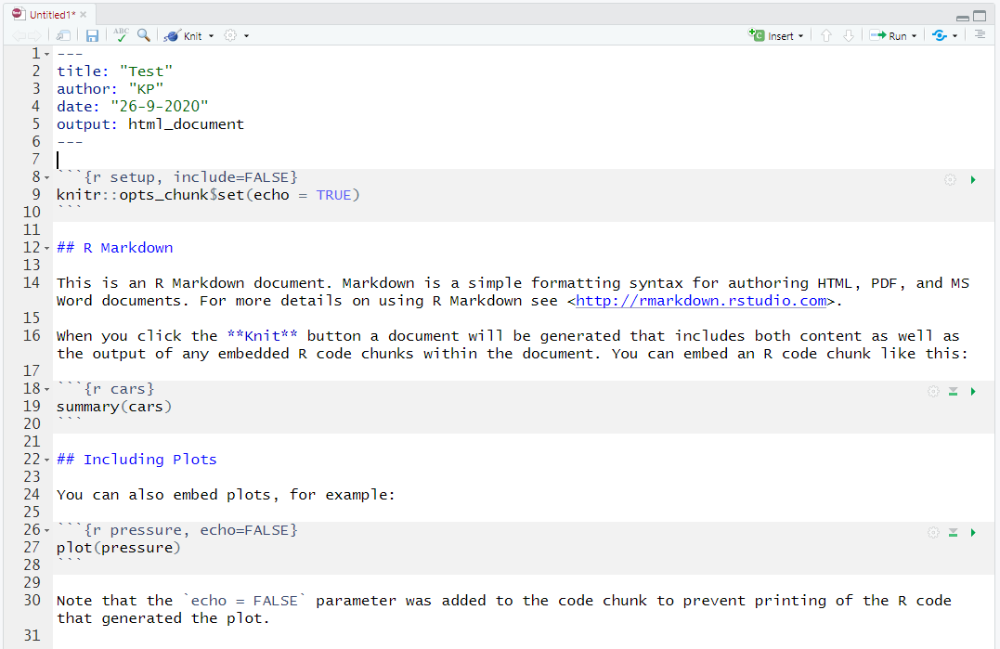
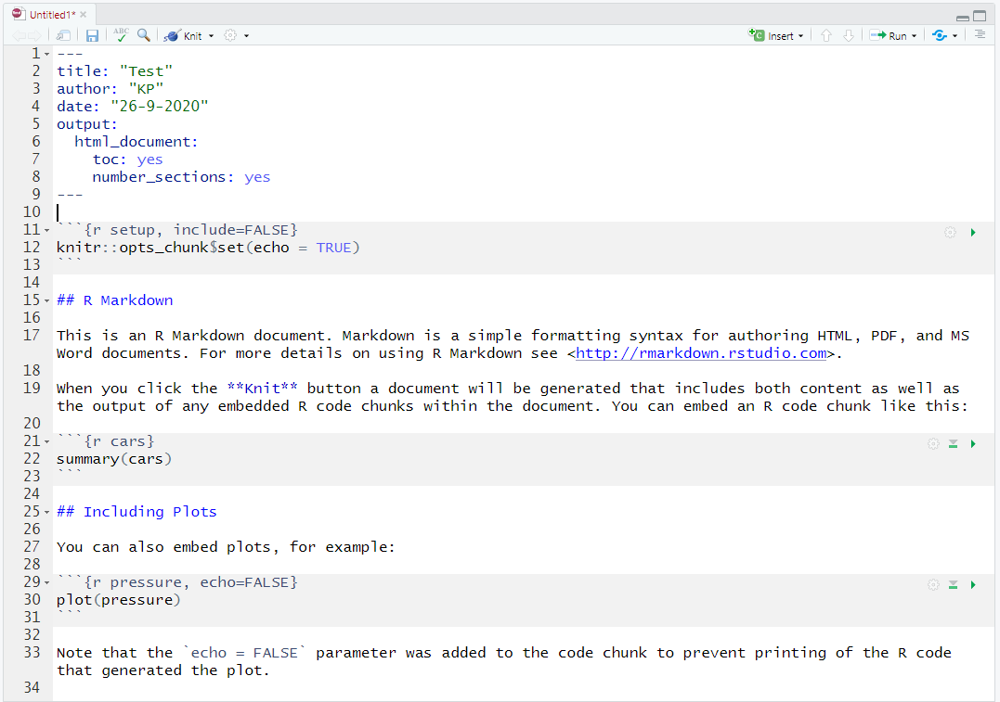
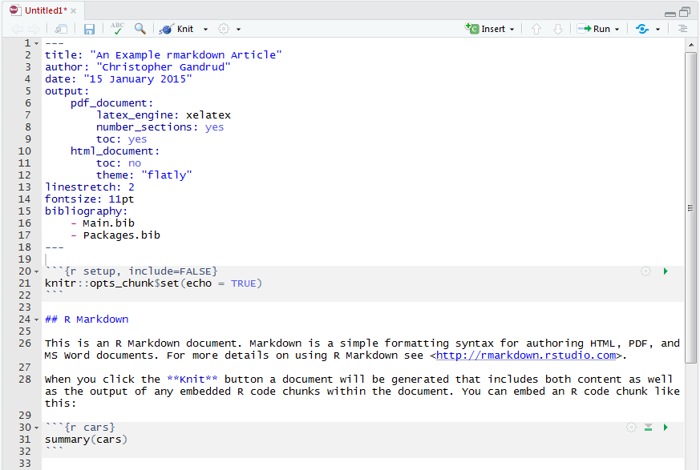
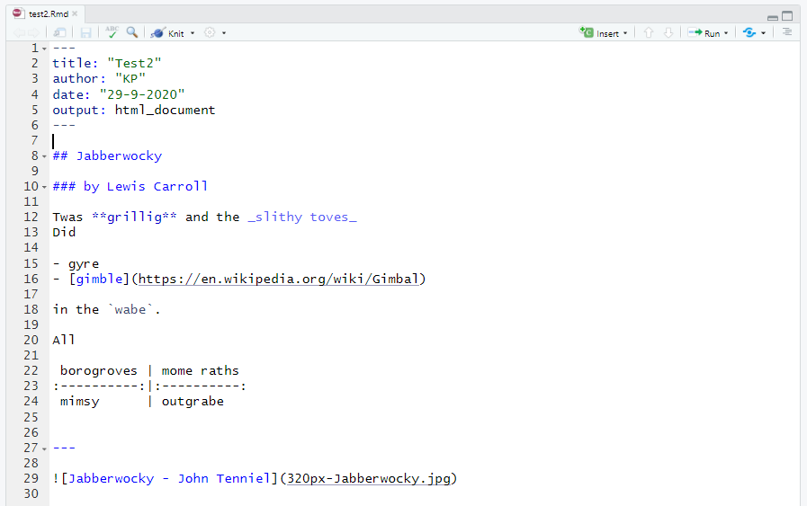
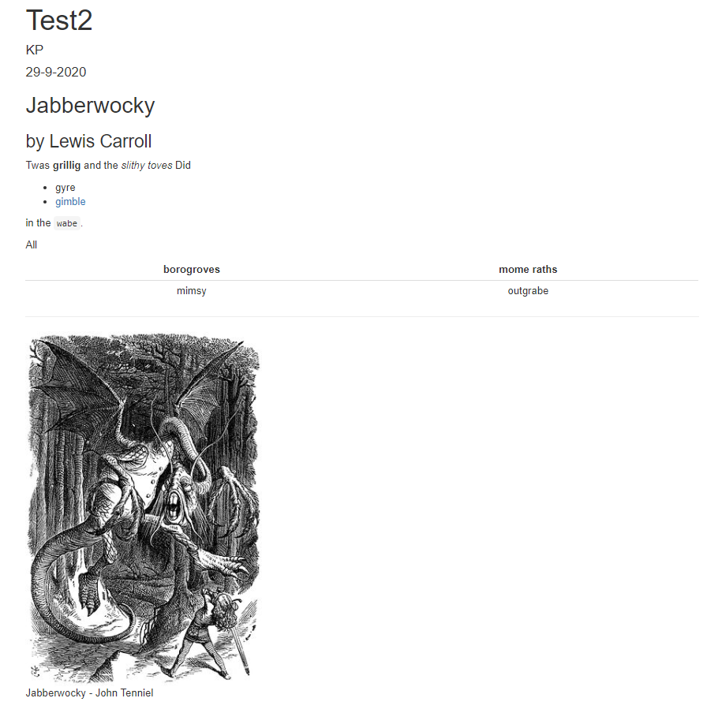
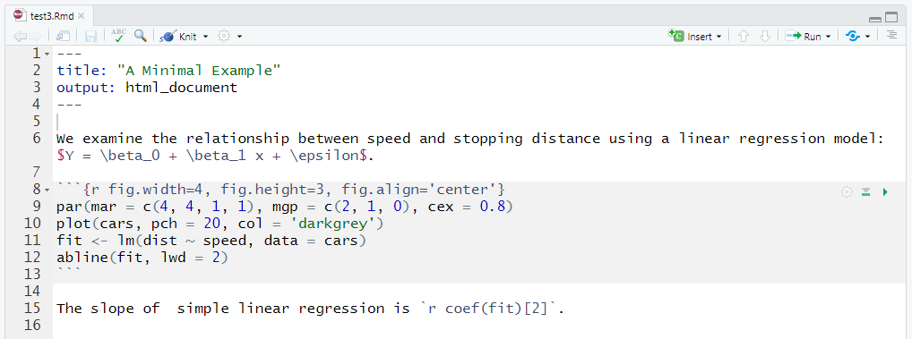
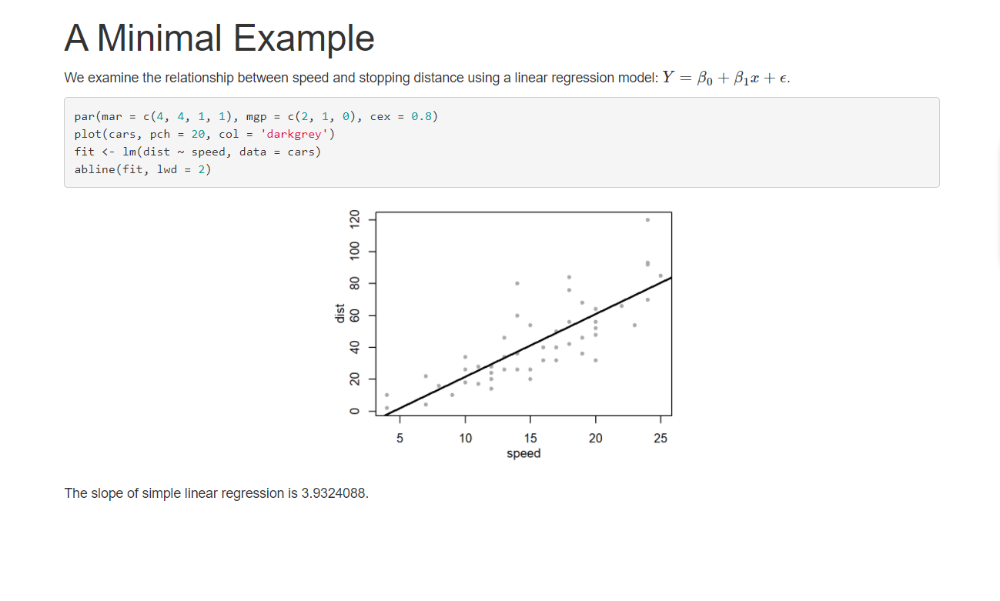

```{r setup, include=FALSE}
knitr::opts_chunk$set(collapse = TRUE, highlight = FALSE)
```

## 16. Writing reproducible reports in R

- 16.1: **Literate programming**
- 16.2: **YAML header**
- 16.3: **Markdown**
- 16.4: **Code chunks**
- 16.5: **Rendering your report**

## 16.1 Literate programming

- Reporting statistical results in R used to involve **two files**:
  - **Text**
  - **Script**
- Your script generates **tables**, **figures** etc. which you import in the text.
  - You have to do your work **twice**.
  - There is a risk for **errors**: changing one file requires adapting the other one.

## 16.1 Literate programming

- This was one of the reasons why Knuth (1984) launched the idea of **literate programming**:

```
Execute one overall “source file” containing both text and code;
the text is typeset, the code is run and its output is included.
```

- Knuth himself developed TeX, which would later become LaTeX.

## 16.1 Literate programming

- R has two possibilities for literate programming:
  - The core function `Sweave()` which uses (La)TeX only.
  - The packages **knitr** and **rmarkdown**  which can handle a variety of formats.
- This chapter covers the **rmarkdown** package which automatically loads the **knitr** package.

## 16.1 Literate programming

- Note the difference between the R packages **markdown** and **rmarkdown**:
  - The **markdown** package can only produce HTML output.
  - The **rmarkdown** can produce various output formats, since it makes use of John MacFarlane's (2006) [Pandoc](https://pandoc.org/).
- In addition, there are [small syntax differences](https://rmarkdown.rstudio.com/authoring_migrating_from_v1.html) between both packages.

## 16.1 Literate programming

- You can create a new source file in **RStudio** via the menu **File > New File > R Markdown...**.
- In the pop-up window you can specify a **title** of the source file and the name of the **author**.
- The options in the left-hand panel point to different formats for presentations or Shiny apps, but the default is a **document** in **html**.

---

```{r exampleTemplate, echo=FALSE, fig.align="center", out.width="100%"}

```

## 16.1 Literate programming

- People who prefer **LaTeX** can create a source file via the menu **File > New File > R Sweave**.
- However, note that there are some small syntax differences between the `Sweave()` function and the **knitr** package: see [Xie (2015: 233-238)](https://yihui.org/knitr/demo/sweave/) (= §16.1).
- That is why you also have to specify the **engine** in the menu **Tools > Global Options... >** panel **Sweave**.

## 16.1 Literate programming

<div class="columns-2">

```{r exampleComponents, echo=FALSE, ref.label="exampleTemplate", fig.align="center", out.width="100%"}

```

- A source file always has three components:
  - A **YAML** header
  - Text in **Markdown** syntax
  - **Code chunks** with **chunk options**
- These will be "woven"/"knitted" into the final report.

</div>

## 16.2 YAML header

- Is a series of **metadata** and specifications for the **compilation** of the report.
  - Hence, comparable to a LaTeX **preamble**.
  - YAML is a recursive acronym for "[YAML Ain't Markup Language](https://yaml.org)".
- It is **delimited**/**wrapped** by `---` (i.e. three hypens) on the **line before** and the **line after**.
- Each line is **key-value pair**, separated by a `:`.
- Typical items are `title`, `author` and `date`, but R Markdown also has `output` to specify [different output formats](https://rmarkdown.rstudio.com/formats.html).

---

E.g. This source file...

```{r exampleHeader1, echo=FALSE, ref.label="exampleTemplate", fig.align="center", out.width="85%"}

```

---

... produces this report:

```{r exampleHeader2, echo=FALSE, fig.align="center", out.width="75%"}
knitr::include_graphics("Ex 02bis - output.PNG")
```

## 16.2 YAML header

- Additional specifications for a certain output file can be listed on **indented lines**.
- See the overview of available items at the help file of the output format: e.g. `help(html_document)`.

---

```{r exampleIndentation, echo=FALSE, fig.align="center", out.width="100%"}

```

## 16.2 YAML header

- With proper indentation you can even generate **multiple output files**, each with its own specifications.
- Specifications common to **all output files** can be listed on **non-indented lines**.
- See the [Pandoc user's guide](https://pandoc.org/MANUAL.html) for all possible items.

---

E.g. from Gandrud (2015: 257-258):

```{r exampleGandrud, echo=FALSE, fig.align="center", out.width="100%"}

```

## 16.2 YAML header

- The **themes** which R Markdown uses for HTML files are from [Bootswatch](https://bootswatch.com/).
- You can also specify a **CSS** file with the item `css:`.

## 16.3 Markdown

- Text blocks in the source file are formatted with [Markdown](https://daringfireball.net/projects/markdown/).
- Markdown is a **lightweight markup language**, developed by John Gruber (2004) originally to facilitate typesetting HTML files.
- The following six slides discuss the main features of [(R) Markdown syntax](https://rmarkdown.rstudio.com/authoring_basics.html).

## 16.3 Markdown

- **Italic** text: wrapped between `* *` or `_ _`
- **Bold** text: wrapped between `** **` or `__ __`
- **Subscript** text: wrapped between `~ ~`
- **Superscript** text: wrapped between `^ ^` ([different in the **markdown** package](https://rmarkdown.rstudio.com/authoring_migrating_from_v1.html))
- **Strikethrough** text: wrapped between `~~ ~~`
- **Verbatim/Typewriter** text: wrapped between \` \`
  - This can be useful for **inline code**
  - However, it will **not** be **executed** (see later).

## 16.3 Markdown

- **Header**: line starting with `#`, `##`, `###` etc.
  - Number of `#`'s determines the **level** of the header/sector.
  - This can go up to **six** levels deep.
- **Paragraph**: subsequent lines of text surrounded by two blank lines
- **Hard return**:
  - Line ending in two spaces
  - Line ending in \\
- **Horizontal line** along the width of a page: line with **three or more** tokens of `-`, `_` or `*`

## 16.3 Markdown

- **Unordered/Bulleted list**: subsequent lines starting with `*`, `-` or `+`
  - Indentation produces sublists.
  - The bullet symbol may change in sublists.
- **Ordered/Numbered list**: subsequent lines starting with `1.`, `2.`, `3.` etc.
  - Indentation needs to be done (again) with `*`, `-` or `+`.
  - However, this produces `1.1`, `1.2` etc.
- **Blockquote**: lines starting with `>`
- **Verbatim block**:
  - Lines surrounded by \`\`\` \`\`\` (on the line before and after)
  - Lines indented by **four spaces**

## 16.3 Markdown

- **Table**: lines of text in the arrangement below
  - The `:` in the second row determines the **alignment** of the column.
  - These lines can also be created by a **code chunk** with the function `kable()` of the **knitr** package:

```
   First Column Title | Second Column Title
   :-----------------:|:--------------------
   Cell Content       | Cell Content
   Cell Content       | Cell Content
```

- **Figure**:
  - A **pointer** to a file of the form `` in which the alt text is **optional** (e.g. ``).
  - A **code chunk** with the function `include_graphics()` of the **knitr** package.

## 16.3 Markdown

- **Inline math**: LaTeX expression wrapped between `$ $`
- **Block math**: LaTeX expression surrounded by `$$ $$` (on the line before and after)
- **Link**:
  - **Without alt text**: a url wrapped between < > (e.g. `<https://rstudio.com>` becomes <https://rstudio.com>).
  - **With alt text**: a pointer of the form `[alt text](url)` (e.g. `[RStudio](https://rstudio.com)` becomes [RStudio](https://rstudio.com))
- **Special characters**:
  - **\#**, **\***, **\-**, **\+**, **\_**, **\{**, **\}**, **[**, **]**, **(**, **)**, **\>**, **\!**, **\.**, **\`**: escape with \\
  - **&**: `&amp`
  - **<**: `&lt`

## 16.3 Markdown

- **Footnote** (not in the **markdown** package):
  - A pointer of the form `[^number]` or `[^title]` in the running text
  - A separate line of the form `[^number]: explanation` or `[^title]: explanation`
- **Citation** (not in the **markdown** package):
  - One needs to have specified a **.bib** file in the `bibliography` field of the **YAML** header.
  - Every entry in the **.bib** file can be referenced by attaching `@` to the BibTeX key of the entry in the **.bib** file.
  - Parentheses around the references are produced by wrapping the reference between `[ ]`.

---

E.g. This source file...

```{r exampleMarkdown, echo=FALSE, fig.align="center", out.width="90%"}

```

---

...produces this report:

```{r exampleMarkdown2, echo=FALSE, fig.align="center", out.width="60%"}

```

## 16.4 Code chunks

- Next to text, source files can also contain **code** to be executed:
  - **Inline code**: single command wrapped between \``r` \`
  - **Code chunk**: block of commands surrounded by \`\`\``{r }` \`\`\`  (on the line before and after)
- **Inline code** will always be replaced by its **result**.
- **Code chunks** allow for finer control because of **chunk options**.

---

```{r exampleChunk, echo=FALSE, ref.label="exampleTemplate", fig.align="center", out.width="100%"}

```

## 16.4 Code chunks

- The wrapper \`\`\``{r }` \`\`\` can be typed, but in **RStudio** it can also be created with the button **Insert**.
- It is good practice to give each code chunk a unique **chunk label**:
  - Immediately after the `r` and a space (inside the braces).
  - Quotation marks are not necessary.
  - If left unspecified, then **knitr** will automatically assign a sequence number as the chunk label.
  - If two chunks have the same label, then **knitr** will produce an error.
- The **chunk options** can be specified in the same way as **arguments** in R.
- The following six slides discuss the most important [chunk options](https://yihui.org/knitr/options/).

## 16.4 Code chunks

- `echo`: show the code itself in the output or not
  - For the whole code chunk: `TRUE` or `FALSE`
  - For specific code lines: numeric vector of line numbers
- `eval`: execute/“evaluate” the code chunk
  - For the whole code chunk: `TRUE` or `FALSE`
  - For specific code lines: numeric vector of line numbers
- `include`: show both the code and its results in the output (`TRUE` or `FALSE`)
- `results`: how to show the results in the output
  - `'markup'`: mark up in LaTeX environments or HTML tags
  - `'asis'`: write the raw results from R to the output file
  - `'hide'`: do not show the results
  - `'hold'`: show all results together at the end of the chunk

## 16.4 Code chunks

 Chunk option       | Commands are executed | Commands are shown in output | Results are shown in output
:-------------------|:---------------------:|:----------------------------:|:---------------------------:
 `eval = FALSE`     | No                    | Yes                          | No
 `echo = FALSE`     | Yes                   | No                           | Yes
 `results = 'hide'` | Yes                   | Yes                          | No
 `include = FALSE`  | Yes                   | No                           | No

## 16.4 Code chunks

- `warning`: show warning messages in the output (`TRUE` or `FALSE`)
- `error`: show error messages in the output (`TRUE` or `FALSE`)
- `message`: show any message in the output (`TRUE` or `FALSE`)
- `highlight`: use syntax highlighting of the code (`TRUE` or `FALSE`)
- `tidy`: reformat the code into tidy output (`FALSE` or `TRUE`)
- `prompt`: show the prompt symbol (viz. `>`) in the report (`FALSE` or `TRUE`)
- `comment`: character symbol to be put in front of computed results in the report (default = `##`)
- **Only for LaTeX**:
  - `background`: color for the background of the code chunk in the report
  - `size`: fontsize of the chunk output

## 16.4 Code chunks

- `fig.height`: (numeric) height of the plot window in R
- `fig.width`: (numeric) width of the plot window in R
- `fig.asp`: (numeric) aspect ratio of the plot window in R
- `fig.dim`: vector of resp. the `fig.width` and `fig.height`
- `fig.align`: alignment of the plot in the report
  - `'left'`
  - `'center'`
  - `'right'`

## 16.4 Code chunks

- `fig.keep`: which images to keep as single plots
  - `'high'`: keep only the high-level plots (i.e. integrate all low-level commands in one plot)
  - `'none'`: keep no plots
  - `'all'`: keep all plots (i.e. low-level commands produce different plots)
  - `'first'`: keep only the first plot
  - `'last'`: keep only the last plot
  - Numeric sequence number of the plot to keep
- `fig.show`: how to arrange the plots in the report
  - `'asis'`: show the plots as they appear in R
  - `'hold'`: show all plots together at the end of the chunk
  - `'animate'`: integrate all plots into an animation
  - `'hide'`: do not show the plots in the report

## 16.4 Code chunks

- `out.height`: height of the plot in the report
  - `'8cm'`
  -  `'300px'`
  - ...
- `out.width`: width of the plot in the report
  - `'3cm'`
  - `'60%'`
  - ...
- `dev`: the graphical device to use (e.g. `dev='png'`)
- `dev.args`: list of arguments for the graphical device
- `dpi`: dots per inch (default = `72`)
- ...

---

E.g. This source file (from Xie 2016: 15-16)...

```{r exampleChunkOptions, echo=FALSE, fig.align="center", out.width="100%"}

```

---

... produces this report:

```{r exampleChunkOptions2, echo=FALSE, fig.align="center", out.width="100%"}

```

## 16.4 Code chunks

- The **knitr** package has more chunk options for **LaTeX reports**.
- Then, there are more **advanced** chunk options:
  - `cache`: cache the results of a (computationally intensive) code chunk (`FALSE` or `TRUE`)
  - `ref.label`: (character) label of another code chunk which should be rerun
  - `child`: (character) name of another source file to be integrated with this source file (into one report)
  - `engine`: programming language to use for running the code chunk
  - ...
- You can even **design** your own chunk options.

## 16.4 Code chunks

- If a certain chunk option should apply to **all code chunks**, then it is best specified as a "**global option**":
  - You list it as an **argument** of the function `knitr::opts_chunk$set( )`.
  - You execute this in the **first chunk** of the source file (just under the YAML header).
- Such a first chunk is typically the **setup chunk**:
  - It contains code to be executed but nothing to be shown in the report.
  - Hence, the setup chunk can itself have the chunk option `include = FALSE`.
  - The setup chunk is also the right place to specify **R options** with the function `options()`.
- Chunk options of later code chunks can (temporarily) override the global default.

---

```{r exampleSetup, echo=FALSE, ref.label="exampleTemplate", fig.align="center", out.width="100%"}

```

## 16.4 Code chunks

- The **knitr** package also has some [package options](https://yihui.org/knitr/options/#package-options) which can be set with the function `knitr::opts_knit$set( )`.
- Further customization can be done with "[hooks](https://yihui.org/knitr/hooks/)" (not covered here).

## 16.5 Rendering your report

- When your source file is ready, you can **render** it to a report:
  - by clicking on the button **Knit** in **RStudio**
  - by using the function `render()`of the **rmarkdown** package
- Rendering involves the following process flow:

```{r exampleRender, echo=FALSE, fig.align="center", out.width="100%"}
knitr::include_graphics("rmarkdownflow.png")
```

- The `render()` function can also be used with the argument `params` which overrides the settings in the YAML header.

## 16.5 Rendering your report

- By default, a source file has the extension **.Rmd** (or **.Rnw** for LaTeX).
- However, the **knitr** package also has two functions for rendering a report from an **.R** script:
  - `stitch()`
  - `spin()`
- The `stitch()` function is a quick-and-dirty version of the `spin()` function (using a template with default values).

## 16.5 Rendering your report

- There are functions for extracting an **.R** script out of a **source file**:
  - `purl()` in the **knitr** package
  - `Stangle()` (core)
- Essentially, both functions return all the code chunks in a script.

## 16.5 Rendering your report

- R Markdown is under constant development (by RStudio).
- The most elaborate extension is the **[bookdown](https://bookdown.org/yihui/rmarkdown/)** package which allows for additional output formats:
  - Books
  - Dashboards
  - Presentations
  - Websites
  - ...
- E.g. The source files for this course are available on [my Github page](https://github.com/kplevoet/Rstats/Reference_materials).
